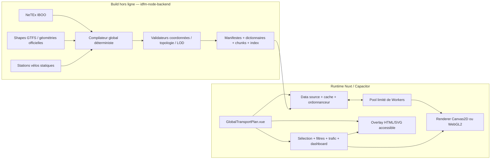

# Global Transport Plan V2 — plan d’implémentation et de validation

> Document canonique pour l’exécution par Luna Max en mode Goal.
>
> Statut : proposition détaillée, prête à être exécutée phase par phase.
>
> Dernière mise à jour : 2026-08-02.
>
> Périmètre : `TransportClockGPT` et le compilateur de données statiques dans `../idfm-node-backend`.

> Cartographie actuelle des routes : `/map` est l’expérience V2 MapLibre +
> Deck.gl/WebGL2 ; `/map/legacy` conserve l’expérience Canvas2D/raster. Les
> Les références historiques à l’ancienne page racine désignent désormais
> `pages/map/index.vue`.

## 1. Résultat final attendu

Créer une nouvelle carte globale interactive accessible à `/map`, sans remplacer ni déstabiliser la V1 existante :

- la V1 reste `src/features/line-map/DetailedLineMapPicker.vue` ;
- la V2 commence par `src/features/line-map/GlobalTransportPlan.vue` ;
- les primitives réutilisables de la V2 vivent dans un module séparé, indépendant des façades Vue ;
- le réseau francilien statique est précompilé par `idfm-node-backend` ;
- le runtime ne parse jamais NeTEx et ne charge jamais les 2 011 lignes une par une ;
- les assets géographiques statiques fonctionnent hors connexion dans Capacitor ;
- le rendu reste fluide pendant zoom, pan et pincement avec toutes les familles activées ;
- les coordonnées des stations ne dérivent pas avec le zoom, le niveau de détail, le DPR, le renderer ou les transitions de tuiles ;
- Canvas 2D est le renderer de référence et le fallback ;
- WebGL2 n’est retenu comme renderer principal que s’il gagne un benchmark reproductible ;
- WebGPU reste expérimental et ne fait pas partie du chemin critique ;
- Vue Flow reste réservé aux vues schématiques ou détaillées, pas à la carte globale géographique.

Le terme « 60 fps » est un objectif mesuré sur une matrice matérielle définie, pas une garantie universelle sur tout appareil Android existant. La V2 n’est déclarée terminée que si elle franchit les gates de performance de la section 15 sur le ou les appareils de référence choisis.

## 2. Décisions structurantes à respecter

### 2.1. V1 protégée

Jusqu’à la phase de migration finale :

- ne pas réécrire `DetailedLineMapPicker.vue` ;
- ne pas remplacer son moteur de zoom, ses événements ou sa structure DOM ;
- ne pas changer son contrat public sans test de compatibilité ;
- ne pas rediriger la route de ligne existante vers la V2 ;
- accepter seulement des changements V1 indispensables à l’extraction d’une primitive déjà couverte par des tests de caractérisation ;
- chaque changement touchant la V1 doit être isolé et réversible.

Contrat public V1 actuellement observé :

- props : `line`, `selectedStationId`, `mode`, `selectable`, `ghostNetworkEnabled`, `ghostNetworkScope`, `gtfsLineGeometryEnabled`, `reduceMotion`, `smartTrafficDetection`, `trafficReport`, `trafficCalendarImpactScope`, `selectedDirectionId` ;
- événements : `select` et `directionChange` ;
- modes : `picker` et `explorer` ;
- comportements à préserver : query `station`, sélection, détails, correspondances, entrées, dashboard, trafic, zoom au curseur, pinch, pan, inertie, conservation du centre, tuiles raster progressives et réseau fantôme.

### 2.2. Façades Vue minces

`GlobalTransportPlan.vue` ne doit pas devenir un second composant de 3 000 lignes. Il orchestre :

- la caméra ;
- la source de données ;
- le renderer sélectionné ;
- les overlays ;
- les panneaux ;
- l’état de sélection ;
- les filtres ;
- les événements accessibles.

Les calculs de projection, décodage, LOD, index spatial, hit-test et préparation du rendu restent dans des modules TypeScript testables sans montage Vue.

### 2.3. Géographie statique hors ligne, données dynamiques séparées

Le réseau statique doit fonctionner sans appel externe :

- topologie ;
- coordonnées des stations ;
- géométries de lignes ;
- couleurs et identités ;
- pictogrammes embarqués ;
- correspondances statiques ;
- entrées statiques ;
- index de proximité ;
- stations de vélos statiques si activées.

Une lecture `fetch()` d’un asset embarqué dans l’application Capacitor n’est pas un appel réseau externe. Le gate « zéro réseau statique » signifie qu’aucune URL IDFM, GTFS, Carto, GBFS ou autre domaine distant n’est nécessaire pour afficher la carte de base.

Les informations réellement temps réel ne peuvent pas être simultanément fraîches et garanties sans réseau :

- perturbations trafic ;
- disponibilité des vélos ;
- éventuelles fermetures d’entrées.

Elles utilisent un canal dynamique optionnel avec cache local et état de fraîcheur explicite. En mode hors ligne, la carte affiche le dernier snapshot disponible ou aucun état dynamique, sans dégrader la géographie statique.

### 2.4. Une seule vérité géographique par objet

Pour chaque station ou entrée :

- conserver la coordonnée source et son CRS pour audit ;
- produire une coordonnée WGS84 canonique en `Float64` ;
- produire une coordonnée monde Web Mercator canonique en `Float64` ;
- ne jamais recalculer ni arrondir cette coordonnée selon le zoom ;
- dériver les coordonnées écran uniquement à partir de la caméra courante ;
- pinner les stations, jonctions et limites de tuiles pendant toute simplification LOD ;
- utiliser la même référence canonique pour le marqueur, le hit-test, la recherche de proximité et l’ancrage de la géométrie.

### 2.5. Le GPU est une optimisation interchangeable

Le contrat de renderer doit permettre :

- `canvas2d-worker` ;
- `canvas2d-main-thread` comme fallback ultime ;
- `webgl2` ;
- plus tard seulement, `webgpu` expérimental.

Les états métier et la caméra ne dépendent jamais d’un renderer. Une perte de contexte WebGL doit pouvoir basculer vers Canvas sans perdre la sélection ou la position de la caméra.

## 3. État du dépôt au début du plan

### 3.1. Frontend

Le projet dispose déjà de briques utiles :

- `DetailedLineMapPicker.vue` : environ 3 000 lignes, SVG, tuiles raster, zoom/pan/pinch/inertie, trafic, entrées, correspondances et dashboards ;
- `lineMapData.ts` : chargement de ligne, coordonnées, viewport, tuiles et plans de focus ;
- `network-ghost/geoProjection.ts` : conversion Lambert-93 vers WGS84 et projection Web Mercator ;
- `network-ghost/networkGhostCanvas.ts` : scène Canvas, culling par tuiles, index spatial, hit-test, LRU et budget mémoire ;
- `networkGhostCanvas.worker.ts` : `OffscreenCanvas`, rendu par phases visible/overscan, `ImageBitmap`, génération et annulation logique ;
- `lineMapPerformance.ts` : métriques FPS, p95 et long frames ;
- tests existants de stabilité des coordonnées, du zoom, des Workers et du Canvas.

Le code existant est une source de primitives et de tests, pas un moteur à étendre indéfiniment.

### 3.2. Cache NeTEx actuel

Mesures réalisées sur le cache local présent le 2026-08-02 :

| Mesure | Valeur observée |
| --- | ---: |
| Fichiers d’offre traités | 2 011 |
| Échecs | 0 |
| Taille JSON totale | 188 777 982 octets |
| Lignes bus | 1 951 |
| Lignes rail | 27 |
| Lignes métro | 16 |
| Lignes tram | 15 |
| Cableway | 1 |
| Funicular | 1 |
| Occurrences de nodes `schematic` | 45 574 |
| Identifiants de node uniques | 31 778 |
| Segments `schematic` | 14 510 |
| Couverture de coordonnées | 100 % des occurrences |
| CRS observé | EPSG:2154 pour 100 % des occurrences |

Conséquences :

- les données sont suffisantes pour initialiser un catalogue géographique global ;
- 189 Mo de JSON par ligne ne constituent pas un format runtime acceptable ;
- les 31 778 identifiants uniques ne sont pas automatiquement 31 778 stations commerciales : certains nodes restent des `Quay` ;
- les 45 574 occurrences par ligne doivent être dédupliquées dans un catalogue global ;
- `schematic.segments` fournit surtout une topologie entre stations, pas nécessairement la géométrie fidèle des voies ou routes ;
- le compilateur global doit donc résoudre les identités, compléter les tracés et produire des assets spécialisés.

### 3.3. Limite importante de NeTEx tel qu’il est actuellement exploité

Le cache actuel contient les positions EPSG:2154 et la topologie, mais pas un tracé routier ou ferroviaire suffisamment détaillé pour toutes les lignes. Relier directement deux stations crée une ligne droite et n’est pas une carte géographique fidèle.

Politique de source recommandée :

1. NeTEx reste l’autorité pour l’identité des lignes, l’identité des arrêts, les relations topologiques, les patterns et les coordonnées disponibles.
2. Les géométries de parcours sont prises dans les objets NeTEx géométriques si leur couverture et leur qualité sont démontrées.
3. À défaut, utiliser les shapes GTFS déjà indexées par le projet ou une autre source officielle IDFM précompilée.
4. En dernier recours seulement, une liaison droite est marquée `fallback` et masquée aux LOD où son imprécision serait visible.
5. Chaque segment conserve `geometrySource`, `sourceVersion` et une métrique de qualité.

Il ne faut pas affirmer que « tout vient de NeTEx » si le tracé détaillé vient de GTFS. Le contrat doit être honnête et auditable.

## 4. Faisabilité et position critique

### 4.1. Faisable

Le volume observé est compatible avec une carte fluide si :

- le travail lourd est fait hors ligne ;
- le runtime charge un manifeste et des chunks spatiaux, pas des fichiers par ligne ;
- les coordonnées sont compactées dans des typed arrays ;
- le nombre d’objets Vue/DOM reste faible ;
- les lignes statiques sont mises en cache par tuiles ;
- les labels et stations suivent un LOD strict ;
- le renderer ne reconstruit pas toute la scène à chaque frame ;
- les filtres n’entraînent pas une réactivité profonde sur des dizaines de milliers d’entités.

### 4.2. Non faisable sous une interprétation naïve

Les objectifs suivants sont contradictoires ou irréalistes sans clarification :

- afficher chaque label de chaque station à l’échelle régionale ;
- garantir 60 fps sur tout appareil Android ;
- afficher du trafic frais sans aucun accès réseau ;
- charger 2 011 JSON par ligne ;
- créer un composant Vue ou un node Vue Flow pour chaque station et segment ;
- conserver des coordonnées globales de grande magnitude directement en `Float32` dans un shader à très fort zoom ;
- faire dépendre le rendu de milliers de watchers Vue.

La bonne interprétation de « tout afficher » est : toutes les familles et toutes les lignes sont représentées dans la couche réseau, tandis que le niveau de détail décide quelles stations, géométries détaillées et étiquettes sont lisibles.

## 5. Architecture cible



### 5.1. Arborescence frontend proposée

L’arborescence exacte peut évoluer, mais les responsabilités doivent rester séparées :

```text
TransportClockGPT/
  pages/
    map.vue
  src/features/line-map/
    DetailedLineMapPicker.vue          # V1 stable
    GlobalTransportPlan.vue            # façade V2 demandée
  src/features/transport-map/
    index.ts
    contracts/
      manifest.ts
      network.ts
      renderer.ts
      worker.ts
    data/
      createTransportMapDataSource.ts
      assetLoader.ts
      chunkScheduler.ts
      decodedChunkCache.ts
      networkCatalog.ts
    geo/
      coordinateKernel.ts
      mercator.ts
      camera.ts
      bounds.ts
      lod.ts
    workers/
      transportMap.worker.ts
      workerPool.ts
      protocol.ts
      decodeTask.ts
      spatialTask.ts
      renderTask.ts
    render/
      createRenderer.ts
      canvas2d/
      webgl2/
      diagnostics/
    spatial/
      packedIndex.ts
      hitTest.ts
      radiusQuery.ts
    interaction/
      pointerController.ts
      keyboardController.ts
      inertia.ts
      selectionController.ts
    overlays/
      TransportMapOverlay.vue
      TransportMapStationButton.vue
      TransportMapTooltip.vue
      TransportMapPanels.vue
    state/
      useTransportMap.ts
      useTransportMapSelection.ts
      useTransportMapFilters.ts
      useTransportMapTraffic.ts
    adapters/
      lineModeAdapter.ts
      v1SelectionAdapter.ts
  tests/
    transportMap*.test.ts
    transportMap*.dom.test.ts
```

Règle : aucun fichier n’est créé simplement pour satisfaire cette arborescence. Chaque module apparaît au moment où sa responsabilité existe et possède un test.

### 5.2. Arborescence backend proposée

```text
idfm-node-backend/
  src/transport/global-map/
    contracts.ts
    compileGlobalMap.ts
    ingestNetex.ts
    canonicalizeStations.ts
    resolveLineGeometry.ts
    transformCoordinates.ts
    buildLod.ts
    buildSpatialChunks.ts
    buildSpatialIndexes.ts
    encodeAssets.ts
    validateAssets.ts
    writeManifest.ts
  src/transport/global-map/fixtures/
  test/global-map/
  public/data/global-map/v1/
    manifest.json
    dictionaries.bin
    catalog.bin
    lod/
    indexes/
    reports/
```

Le générateur NeTEx actuel reste utilisable. Le nouveau compilateur peut consommer ses objets ou extraire une bibliothèque commune, mais il ne doit pas casser `generate-netex-cache.ts` tant que le nouveau pipeline n’est pas validé.

## 6. Contrat de données global

### 6.1. Identifiants canoniques

Définir explicitement :

- `lineId` : identifiant stable IDFM, avec mapping vers `line:IDFM:Cxxxxx`, NeTEx et Navitia ;
- `stopPlaceId` : station commerciale canonique ;
- `quayId` : quai physique ;
- `entranceId` : entrée ;
- `bikeStationId` : station de vélos ;
- `segmentId` : segment topologique stable ;
- `geometryId` : géométrie source versionnée ;
- `tileId` ou `chunkId` : partition spatiale stable ;
- `dataVersion` : version immuable de l’ensemble des assets.

Ne jamais dédupliquer uniquement par nom. La résolution globale utilise, dans cet ordre :

1. relation officielle `Quay -> StopPlace` ;
2. identifiant stable officiel ;
3. aliases officiels ;
4. nom normalisé + commune + distance, avec seuil et marge d’ambiguïté ;
5. absence de fusion si le résultat reste ambigu.

Chaque fusion produit une trace d’audit. Les cas refusés restent séparés plutôt que de créer une fausse correspondance.

### 6.2. Coordonnée canonique

Conceptuellement, chaque objet géographique possède :

```text
sourceCrs            = "EPSG:2154"
sourceX/sourceY      = valeurs NeTEx intactes
lon/lat              = WGS84 Float64
worldX/worldY        = Web Mercator normalisé Float64
coordinateSource     = netex | gtfs | official-open-data | bike-source
coordinateAccuracyM = précision déclarée ou estimée
transformVersion     = version de l’algorithme
```

Les champs sources restent dans le rapport ou le catalogue d’audit ; le runtime compact peut ne charger que WGS84/monde et les identifiants nécessaires.

### 6.3. Manifeste runtime

Le manifeste doit au minimum déclarer :

- `schemaVersion` ;
- `dataVersion` et hash de contenu ;
- date de génération ;
- versions des sources ;
- emprise géographique ;
- projection runtime ;
- niveaux LOD ;
- modes disponibles ;
- dictionnaires ;
- fichiers/chunks avec taille compressée, taille décodée et checksum ;
- index spatiaux disponibles ;
- compteurs de stations, lignes, segments, entrées et vélos ;
- erreurs et avertissements de compilation ;
- seuils de quantification utilisés ;
- compatibilité minimale du lecteur.

Le frontend refuse proprement un `schemaVersion` incompatible et affiche un état diagnostique, sans interpréter silencieusement un format inconnu.

### 6.4. Organisation des assets

Objectif : peu de lectures au démarrage et pas d’avalanche par ligne.

Découpage recommandé :

1. un manifeste compact ;
2. un dictionnaire global de chaînes et styles ;
3. un catalogue compact des lignes et stations ;
4. une couche réseau agrégée pour l’affichage régional immédiat ;
5. des chunks spatiaux pour les détails visibles ;
6. des index de stations/entrées séparés ;
7. des données dynamiques hors du bundle statique.

Ne pas figer immédiatement le conteneur. Comparer au moins :

- JSON compact + compression HTTP/build ;
- binaire maison simple avec header/version/offsets et typed arrays ;
- archive de tuiles de type PMTiles seulement si les Range Requests locales fonctionnent de façon fiable dans Capacitor ;
- fichiers de chunks groupés si une archive unique provoque trop de mémoire ou de latence.

Gate de choix : taille, temps de premier affichage, temps de décodage, nombre de lectures, pic mémoire, compatibilité Android et simplicité de debug.

### 6.5. Atomicité et reproductibilité

Le compilateur :

- écrit dans un dossier temporaire versionné ;
- valide tous les fichiers ;
- calcule les checksums ;
- écrit le manifeste en dernier ;
- ne remplace `current` qu’après validation ;
- trie toutes les collections avant encodage ;
- utilise des seeds fixes pour tout algorithme non déterministe ;
- garantit qu’une même entrée produit les mêmes bytes, hors champ `generatedAt` isolé ;
- génère un rapport de diff entre deux versions.

## 7. Pipeline de pré-calcul dans idfm-node-backend

### 7.1. Étape A — inventaire et audit

- lire l’index des 2 011 lignes ;
- vérifier les modes, aliases et couleurs ;
- inventorier les CRS ;
- mesurer `Quay`, `StopPlace`, relations parent/enfant et fallback ;
- identifier les identifiants présents sur plusieurs lignes ;
- mesurer la couverture des shapes détaillées par mode ;
- produire `data-audit.json` et `data-audit.md` ;
- interdire la compilation finale si une anomalie critique dépasse un seuil documenté.

### 7.2. Étape B — catalogue global de stations

- transformer chaque coordonnée EPSG:2154 une seule fois ;
- conserver la valeur source ;
- regrouper les quais sous leur station commerciale ;
- préserver les quais pour les entrées et les informations détaillées ;
- construire les correspondances à partir des lignes qui desservent la station ;
- produire les aliases de recherche ;
- calculer les bounding boxes ;
- attribuer un index entier dense pour les typed arrays ;
- produire les collisions et ambiguïtés dans le rapport.

### 7.3. Étape C — catalogue global des lignes

- normaliser les familles vers une enum interne stable : `BUS`, `METRO`, `RER`, `TRAIN`, `TRANSILIEN`, `TRAM`, `CABLE`, `NOCTILIEN`, éventuellement `BIKE` ;
- distinguer mode NeTEx et présentation commerciale ;
- identifier explicitement Noctilien au sein des bus ;
- résoudre couleur, couleur de texte, label, pictogramme et ordre de priorité ;
- conserver toutes les références externes ;
- générer les relations ligne-station et station-ligne.

### 7.4. Étape D — géométries détaillées

- chercher les géométries officielles NeTEx ;
- mesurer leur couverture et leur continuité ;
- compléter avec les shapes GTFS déjà prises en charge par `TransportClockGPT` ;
- choisir une seule source cohérente par segment ou branche ;
- ne pas mélanger silencieusement deux fournisseurs au sein d’un tracé ;
- projeter les stations sur le tracé avec une distance maximale par mode ;
- pinner les points de station dans la géométrie ;
- conserver séparément l’ancre canonique NeTEx et l’ancre visuelle GTFS choisie
  par proximité, afin de reprendre exactement la continuité de la V1 sans
  déplacer le catalogue partagé ni ses invariants de coordonnées ;
- calculer continuité, longueur, gaps, self-intersections et distance station-tracé ;
- marquer les fallbacks et les segments partiels.

Pour les bus, conserver plusieurs variantes seulement si elles produisent un comportement visible nécessaire. À faible LOD, fusionner les corridors visuels communs sans perdre l’identité de ligne utilisée au hit-test.

### 7.5. Étape E — simplification multi-LOD

La simplification est calculée hors ligne, jamais pendant une frame :

- simplifier en coordonnées métriques ;
- pinner stations, jonctions, terminus, points d’intersection et points de coupe ;
- simplifier globalement avant découpage ou imposer les mêmes vertices de frontière aux chunks voisins ;
- conserver une hiérarchie imbriquée quand possible ;
- définir une erreur maximale en mètres par LOD ;
- ne jamais déplacer un point canonique de station ;
- ne jamais supprimer un segment nécessaire à la connectivité ;
- valider les distances de Hausdorff et la continuité.

### 7.6. Étape F — partition spatiale

- utiliser une grille/quadtree en Web Mercator ;
- attribuer une géométrie aux chunks qu’elle intersecte, avec clipping déterministe ;
- conserver un identifiant logique commun pour les fragments ;
- ajouter un overscan spatial contrôlé ;
- regrouper les petits chunks afin d’éviter des milliers de lectures ;
- séparer les couches très lourdes, notamment bus, si le benchmark le justifie ;
- générer une couche agrégée « whole Île-de-France » pour le premier rendu.

### 7.7. Étape G — index spatiaux

Pré-calculer :

- un index packed R-tree ou équivalent pour les stations ;
- un index pour les entrées ;
- un index segment/ligne par chunk ;
- un index de labels candidats ;
- un index des stations par rayon ;
- un index identifiant -> offset ;
- un index station -> lignes et ligne -> stations.

Les structures sont sérialisables et décodables en typed arrays. Ne pas construire un R-tree global de 30 000 objets JavaScript à chaque ouverture.

### 7.8. Étape H — encodage et validation

- utiliser `Float64` pour les coordonnées canoniques en mémoire de validation ;
- encoder les vertices détaillés en coordonnées locales de chunk quantifiées si le seuil d’erreur est respecté ;
- conserver les stations avec une précision supérieure aux vertices décoratifs ;
- éviter des world coordinates de grande magnitude en `Float32` côté GPU ;
- fournir origine locale + offsets ou high/low split ;
- inclure version, endianness et longueurs dans tout format binaire ;
- rejeter les valeurs non finies, hors emprise ou incohérentes ;
- vérifier chaque checksum après écriture.

## 8. Stratégie de niveaux de détail

Les seuils exacts sont calibrés par benchmark, mais le comportement fonctionnel est défini à l’avance :

| Zoom géographique indicatif | Lignes | Stations | Labels | Entrées/détails |
| --- | --- | --- | --- | --- |
| Vue régionale, z ≈ 8–9 | toutes les familles présentes ; rail structurant dominant ; bus fortement simplifié/atténué | hubs majeurs seulement | noms majeurs et labels de lignes prioritaires | aucun |
| z ≈ 10–11 | toutes les lignes simplifiées et cullées | hubs et stations ferroviaires importantes | labels sans collision, faible densité | aucun |
| z ≈ 12–13 | géométries intermédiaires, bus visible par corridor | rail/tram + stations sélectionnées/proches | lignes et stations prioritaires | données du panneau seulement |
| z ≈ 14–15 | géométries détaillées du viewport | toutes les stations pertinentes dans le viewport | labels cullés/decluttered | entrées de la station active |
| z ≈ 16–20 | précision locale maximale | stations, quais utiles | labels détaillés selon espace | entrées, accès et détails locaux |

Règles absolues :

- changer de LOD ne change jamais la coordonnée canonique d’une station ;
- les marqueurs sélectionnés restent visibles à tous les LOD ;
- les lignes sélectionnées utilisent au minimum le LOD courant, éventuellement un niveau plus détaillé si le budget le permet ;
- les transitions de LOD font un crossfade court ou un swap atomique, jamais deux positions différentes d’une même station ;
- le filtre de mode agit au niveau des buffers/layers, pas par suppression de milliers d’objets Vue ;
- les labels sont une couche indépendante de la géométrie.

## 9. Couche runtime de données

### 9.1. Chargement initial

Le chemin critique de `/map` doit être court :

1. charger le manifeste ;
2. vérifier version et checksum du bootstrap ;
3. charger dictionnaire, catalogue minimal et couche régionale ;
4. afficher un premier frame utile ;
5. demander les chunks du viewport ;
6. décoder d’abord les chunks visibles ;
7. précharger ensuite l’overscan ;
8. charger labels et détails selon le LOD ;
9. démarrer le canal trafic après le premier rendu statique.

Budgets initiaux à valider :

- manifeste compressé : cible ≤ 250 Ko ;
- bootstrap compressé : cible ≤ 2 Mo ;
- données nécessaires au premier viewport : cible ≤ 6 Mo compressés ;
- aucun fichier de ligne individuel au démarrage ;
- concurrence de lecture/décodage : 2 par défaut, 1 sur appareil contraint, maximum 4 après mesure ;
- premier réseau régional visible : cible ≤ 500 ms à chaud et ≤ 1 500 ms à froid sur appareil de référence.

Ces chiffres sont des budgets de départ. Toute révision doit apparaître dans un rapport de benchmark, pas dans une constante modifiée sans justification.

### 9.2. Ordonnanceur de chunks

L’ordonnanceur :

- déduplique les requêtes par clé d’asset ;
- attribue les priorités `critical`, `visible`, `overscan`, `prefetch` ;
- utilise `AbortController` pour les lectures annulables ;
- utilise une `generation` de caméra pour invalider les réponses obsolètes ;
- ne bloque pas un chunk visible derrière un prefetch ;
- applique une backpressure lorsque le Worker ou le GPU est saturé ;
- fusionne les demandes qui couvrent la même fenêtre ;
- journalise bytes, latence, décodage et cache hit sans log verbeux en production ;
- libère les buffers annulés ou évincés.

### 9.3. Caches

Prévoir trois niveaux distincts :

1. cache des bytes lus ;
2. cache des chunks décodés ;
3. cache des ressources renderer, par exemple `ImageBitmap`, buffers GPU ou textures.

Chaque cache possède :

- une limite en entrées ;
- une limite en octets ;
- une politique LRU ;
- une méthode explicite `dispose/close` ;
- des métriques hit/miss/eviction ;
- une réaction à `visibilitychange`, `pagehide`, pression mémoire et perte de contexte ;
- un test prouvant qu’une éviction libère les ressources natives.

Ne pas mettre les gros typed arrays dans l’état réactif profond de Vue. Conserver les buffers dans des classes/objets non réactifs et exposer seulement des versions, compteurs ou `shallowRef`.

### 9.4. Mode hors ligne Capacitor

- embarquer la version validée des assets dans la sortie générée ;
- charger depuis l’origine locale Capacitor ;
- ne pas référencer Carto pour que la géographie fonctionne ;
- rendre le fond de carte optionnel ou fournir un fond minimal embarqué ;
- tester l’ouverture en mode avion après installation fraîche ;
- tester l’ouverture après suppression du cache WebView ;
- vérifier la taille APK/AAB et le temps d’installation ;
- si les assets rendent l’APK trop lourd, prévoir un pack offline installable séparé, mais ne pas l’introduire avant mesure.

## 10. Pool de Web Workers

### 10.1. Intérêt réel

Les Workers sont utiles pour :

- décompression et décodage binaire ;
- construction de buffers de rendu ;
- filtrage par viewport et LOD ;
- requêtes d’index spatial ;
- génération de tuiles Canvas via `OffscreenCanvas` ;
- calcul de candidats de labels ;
- agrégation de diagnostics.

Ils ne compensent pas un mauvais format de données. Le pré-calcul backend reste prioritaire.

### 10.2. Taille du pool

Politique initiale :

- 1 Worker sur appareil à faible capacité ou `hardwareConcurrency <= 4` ;
- 2 Workers sur les autres appareils ;
- ne jamais créer un Worker par ligne ou par tuile ;
- mesurer avant d’autoriser 3 Workers ;
- réserver le thread principal à la caméra, aux événements, à l’accessibilité et à la composition.

Le pool est persistant pour la durée de la carte. Les rôles peuvent être logiques plutôt que des fichiers Worker distincts :

- file de tâches data/index ;
- file de tâches rendu Canvas ;
- priorité aux tâches visibles.

### 10.3. Protocole

Chaque message contient :

- `schemaVersion` ;
- `requestId` ;
- `generation` ;
- `taskType` ;
- `priority` ;
- identifiants d’assets ;
- payload minimal ;
- liste de `Transferable` ;
- résultat ou erreur structurée ;
- métriques de durée et bytes.

Règles :

- transférer les `ArrayBuffer`, ne pas les cloner ;
- ne pas envoyer de proxies Vue ;
- ignorer toute réponse d’une génération obsolète ;
- rendre l’annulation coopérative entre lots de travail ;
- fermer les `ImageBitmap` non utilisés ;
- ne pas exiger `SharedArrayBuffer`, car l’isolation cross-origin peut différer entre web et Capacitor ;
- fournir un chemin sans `OffscreenCanvas`.

### 10.4. Backpressure

- une tâche visible peut préempter un overscan non commencé ;
- limiter le nombre de chunks décodés en attente de rendu ;
- ne pas produire plus d’`ImageBitmap` que le cache ne peut en contenir ;
- lors d’un pan rapide, rendre une couche existante transformée et ne recalculer les détails qu’après un debounce court ;
- pendant le pinch, mettre à jour la transformation visuelle à chaque frame, mais reporter le nouveau LOD à la fin ou à un palier contrôlé.

## 11. Caméra et interactions

### 11.1. État de caméra unique

Utiliser un état indépendant du renderer :

```text
centerWorldX: Float64
centerWorldY: Float64
zoom: Float64
bearing: 0 dans la V2 initiale
viewportWidthCssPx
viewportHeightCssPx
pixelRatio
generation
```

Le réseau reste nord en haut dans la première version. Ne pas ajouter rotation ou pitch tant que le core et les tests de précision ne sont pas stables.

### 11.2. Transformations obligatoires

Une seule implémentation partagée fournit :

- `lonLatToWorld` ;
- `worldToLonLat` ;
- `worldToScreen` ;
- `screenToWorld` ;
- `lonLatToScreen` ;
- `screenToLonLat` ;
- calcul de bounds visibles ;
- conversion d’une tolérance en pixels vers une tolérance métrique ;
- zoom autour d’un point écran ;
- fit bounds ;
- clamp de l’emprise.

Canvas, WebGL, overlays, hit-test et tests utilisent ce même kernel. Il est interdit de réimplémenter une formule dans un composant.

### 11.3. Gestes

À livrer et tester :

- drag souris ;
- pointer events tactiles ;
- pinch centré sur le centroïde des touches ;
- wheel/trackpad centré sous le curseur ;
- boutons zoom centrés sur le viewport ;
- double-click optionnel, seulement s’il ne gêne pas la sélection ;
- inertie avec friction indépendante du framerate ;
- annulation de l’inertie au nouveau geste ;
- clamp sans rebond incohérent ;
- conservation de l’ancre géographique ;
- respect de `prefers-reduced-motion` et du setting existant ;
- interactions clavier.

### 11.4. Clavier

Le canvas ou conteneur principal est focusable et possède un nom accessible. Commandes minimales :

- flèches : déplacement ;
- `+` et `-` : zoom ;
- `0` : vue régionale ;
- `Enter` : sélectionner l’élément actif ;
- `Escape` : fermer tooltip/panneau ou désélectionner le niveau courant ;
- `Tab` : parcourir les contrôles et une liste virtualisée de résultats, pas 30 000 marqueurs DOM ;
- raccourci documenté pour ouvrir recherche/filtres si ajouté.

Le déplacement clavier et le focus d’une station déclenchent une annonce `aria-live` concise.

## 12. Couche de rendu

### 12.1. Renderer Canvas 2D de référence

Le premier renderer fonctionnel doit prolonger les enseignements de `network-ghost` :

- tuiles visibles + overscan ;
- `OffscreenCanvas` si disponible ;
- transfert d’`ImageBitmap` ;
- batch par couleur/style/mode ;
- culling par bounds ;
- cache LRU borné en octets ;
- couche statique réutilisée pendant les gestes ;
- couche dynamique séparée pour highlight et sélection ;
- fallback sur rendu main thread découpé en petits lots ;
- rendu par mode ou groupe de styles pour filtrage rapide.

Optimisation clé : pendant pan/zoom continu, composer des tuiles déjà rendues. Ne pas retracer les dizaines de milliers de segments à chaque frame.

### 12.2. Candidat WebGL2

Construire un prototype derrière le même contrat une fois le Canvas de référence mesurable :

- buffers par chunk et LOD ;
- coordonnées locales au chunk ou origine caméra pour protéger la précision ;
- mesh de polylines avec joins/caps adaptés ;
- batch/instancing par style ;
- uniformes pour filtre, opacité et sélection ;
- picking CPU via l’index spatial dans un premier temps ;
- gestion de perte/restauration de contexte ;
- limites explicites de textures/buffers ;
- destruction de toutes les ressources.

Ne pas utiliser le framebuffer de picking comme seule solution accessible. Le modèle de sélection reste indépendant.

### 12.3. Gate Canvas vs WebGL2

Comparer sur exactement les mêmes données, caméra et scénarios :

| Critère | Poids |
| --- | ---: |
| p95 frame time pendant pan/pinch | critique |
| delivered-frame ratio | critique |
| pic mémoire et mémoire stable | critique |
| temps de premier rendu | élevé |
| changement de filtres | élevé |
| sélection/highlight | moyen |
| fidélité visuelle | élevé |
| fidélité des coordonnées | critique |
| perte de contexte / fallback | critique |
| complexité de maintenance | élevé |
| compatibilité Android WebView | critique |

Décision :

- Canvas devient renderer principal s’il atteint tous les gates ;
- WebGL2 devient renderer principal seulement s’il améliore de manière significative le scénario limitant et passe tous les tests de précision/fallback ;
- même si WebGL2 gagne, Canvas reste supporté ;
- aucune décision sur la base d’un benchmark desktop seulement.

### 12.4. WebGPU

WebGPU n’est pas un livrable initial :

- ne pas l’ajouter au bundle production ;
- ne pas créer de troisième implémentation avant stabilisation ;
- l’évaluer seulement si WebGL2 ne satisfait pas le besoin et si la couverture des WebView cibles est mesurée ;
- conserver le même contrat de renderer.

### 12.5. SVG/HTML overlay

Réserver l’overlay à un nombre borné d’éléments :

- station active ;
- stations multi-sélectionnées ;
- stations survolées/focus ;
- quelques labels prioritaires ;
- tooltip ;
- contrôles ;
- panneaux ;
- annonces accessibles.

Ne pas créer une balise SVG/HTML par station globale. Les stations non actives sont dessinées par le renderer et représentées dans une liste accessible virtualisée/recherchable.

## 13. Index spatial et sélection

### 13.1. Deux niveaux d’index

1. Index packed global précompilé pour stations/entrées et requêtes de proximité.
2. Index léger par chunk pour lignes/segments visibles et hit-test au pointeur.

### 13.2. Hit-test

Pipeline :

1. convertir le point écran en world coordinate ;
2. convertir le rayon tactile/souris en world units ;
3. requêter l’index de stations ;
4. requêter l’index des segments ;
5. calculer la distance exacte aux quelques candidats ;
6. classer selon distance, z-order, mode visible et état sélectionné ;
7. appliquer une hystérésis pour éviter le scintillement de hover ;
8. renvoyer un objet métier, pas un élément graphique.

Tolérance minimale recommandée :

- souris : environ 6–8 CSS px ;
- tactile : environ 20–24 CSS px ;
- clavier/recherche : pas de dépendance au pixel.

La tolérance en pixels reste stable visuellement et sa conversion géographique dépend du zoom.

### 13.3. Sélection

État explicite :

- `activeLineId` ;
- `activeStationId` ;
- `hoveredFeature` ;
- `focusedFeature` ;
- `selectedStationIds` ordonnés ;
- limite de sélection configurable ;
- mode `replace`, `toggle` ou `append` ;
- provenance de la sélection : pointeur, clavier, recherche, URL, proximité.

La multi-sélection pour dashboard réutilise les services de préférences existants via un adapter. Elle ne lit ni n’écrit directement `localStorage` dans le renderer.

### 13.4. Recherche de proximité future

Livrer dès le core :

- `queryStationsWithinRadius({ lon, lat }, radiusMeters, filters)` ;
- tri distance puis importance ;
- résultat déterministe ;
- limite et pagination ;
- test avec stations à cheval sur plusieurs chunks.

Le géocodage d’une adresse est un adapter séparé. Il peut être distant ou offline plus tard ; il ne doit pas polluer le moteur géographique.

## 14. Fonctionnalités métier

### 14.1. Filtres de mode

- enum stable interne ;
- visibilité par mode dans un bitmask ;
- état partageable dans l’URL si souhaité ;
- application renderer sans recréer le catalogue ;
- style atténué possible pour les modes non actifs ;
- `Tout afficher` restaure exactement l’état global ;
- Noctilien peut être un sous-mode de bus dans les données, mais reste filtrable comme demandé ;
- `TRAIN` et `TRANSILIEN` doivent être définis sans double comptage.

### 14.2. Couleurs, pictogrammes et labels

- compiler les styles de ligne hors ligne ;
- embarquer les pictogrammes sous forme d’atlas ou d’assets locaux ;
- utiliser les couleurs officielles avec fallback documenté ;
- calculer le contraste du texte ;
- séparer label de ligne et label de station ;
- générer les candidats de labels dans le Worker ;
- résoudre les collisions dans le viewport, avec budget maximal ;
- stabiliser les labels pendant un petit pan pour éviter le scintillement.

### 14.3. Correspondances

- pré-calculer `station -> lineIds` ;
- distinguer correspondance au même StopPlace et correspondance à pied ;
- conserver les distances et la provenance ;
- réutiliser les règles conservatrices existantes ;
- ne jamais fusionner deux stations par simple token partagé ;
- afficher les correspondances détaillées dans l’overlay/panneau, pas toutes sur le canvas régional.

### 14.4. Perturbations trafic

- réutiliser les types et normalisations de `src/features/traffic` ;
- construire un mapping fiable des impacts vers `lineId`, `stopPlaceId` et segments ;
- charger le trafic après la géographie ;
- conserver un snapshot horodaté ;
- appliquer seulement un petit buffer d’état au renderer ;
- afficher interruption/disturbance sans reconstruire les géométries ;
- permettre time travel si le contrat existant le fournit ;
- indiquer clairement données absentes ou périmées ;
- conserver le fonctionnement statique hors ligne.

### 14.5. Entrées et informations détaillées

- ne pas charger toutes les entrées au bootstrap ;
- charger/indexer les entrées à fort zoom ou à la sélection ;
- relier une entrée au StopPlace/quai par relation officielle avant distance ;
- réutiliser les protections existantes contre une entrée proche mais non liée ;
- afficher code, nom, accessibilité et distance si disponibles ;
- permettre focus caméra depuis un contrôle clavier.

### 14.6. Vélos

Phase optionnelle après le réseau de transport :

- compiler `station_information` ou open data statique dans le backend ;
- mapper l’opérateur et un identifiant stable ;
- indexer les coordonnées comme une couche séparée ;
- charger `station_status` dynamiquement si le réseau est disponible ;
- afficher la fraîcheur et le statut offline ;
- ne pas bloquer le DoD du cœur transport si la source vélo n’est pas encore stabilisée.

## 15. Budget de performance et protocole 60 fps

### 15.1. Définition mesurable

Sur un écran 60 Hz, `requestAnimationFrame` peut rapporter 59.x fps. Le gate principal utilise donc :

- ratio de frames délivrées / frames attendues ≥ 0,98 après warmup ;
- médiane du frame time ≤ 16,7 ms ;
- p95 du frame time ≤ 18 ms ;
- p99 ≤ 25 ms ;
- aucune frame > 50 ms pendant un geste standard, hors première compilation shader explicitement exclue du warmup ;
- aucune long task > 50 ms déclenchée par le moteur pendant l’interaction ;
- aucune croissance mémoire continue après 5 cycles complets du scénario.

Le rapport peut afficher « 60 fps atteint » uniquement si ces critères sont satisfaits.

### 15.2. Matrice matérielle

Avant le benchmark final, inscrire dans le rapport :

- modèle exact du téléphone ;
- SoC/GPU ;
- RAM ;
- version Android ;
- version Android System WebView/Chrome ;
- résolution, DPR et fréquence ;
- état batterie et température ;
- version APK et `dataVersion` ;
- renderer ;
- flags actifs.

Matrice minimale :

1. navigateur desktop Chromium pour diagnostic ;
2. appareil Android de référence milieu de gamme ;
3. appareil Android plus faible ou ancien si disponible ;
4. Capacitor release build, pas seulement dev server.

Le téléphone milieu de gamme de référence constitue le gate dur. Le téléphone faible reçoit un objectif dégradé documenté si 60 fps n’est pas physiquement atteignable, sans masquer le résultat.

### 15.3. Scénarios reproductibles

Créer un replay déterministe de caméra :

1. ouverture régionale toutes familles actives ;
2. pan horizontal de 10 secondes ;
3. pan diagonal de 10 secondes ;
4. pinch/zoom z9 -> z15 autour d’une station ;
5. zoom z15 -> z9 ;
6. inertie rapide ;
7. sélection d’une ligne ;
8. sélection d’une station ;
9. activation/désactivation bus ;
10. activation de toutes les familles ;
11. ouverture/fermeture trafic ;
12. déplacement sur une zone dense parisienne ;
13. déplacement sur une zone périphérique ;
14. cycle répété cinq fois pour détecter fuite et thrashing.

Exécuter :

- 3 cold runs ;
- 5 warm runs ;
- au moins 30 secondes mesurées par scénario long ;
- résultats bruts JSON conservés ;
- médiane inter-run et pire run rapportés ;
- aucun résultat choisi manuellement.

### 15.4. Budgets par sous-système

Valeurs initiales à profiler :

| Sous-système | Budget interaction |
| --- | ---: |
| Traitement événement + caméra | ≤ 1 ms/frame p95 |
| Mise à jour overlay Vue | ≤ 2 ms/frame p95 |
| Composition/draw calls | ≤ 8 ms/frame p95 |
| Travail principal total du moteur | ≤ 10 ms/frame p95 |
| Décodage Worker d’un chunk visible | ≤ 20 ms, découpé/annulable |
| Requête hit-test | ≤ 2 ms p95 |
| Changement de filtre | feedback ≤ 100 ms |
| Sélection | feedback visuel ≤ 50 ms |
| Pic mémoire décodée initial | cible ≤ 120 Mo |
| Cache renderer | cible configurable 32–96 Mo selon appareil |

Le pic mémoire total de la WebView doit être mesuré sur appareil. Les budgets sont réduits si Android tue le processus ou déclenche du GC visible.

### 15.5. Instrumentation obligatoire

- étendre les idées de `lineMapPerformance.ts` sans dépendre du composant V1 ;
- mesurer frame times, long tasks, dropped frames, Worker time, decode time, cache hit, bytes, tile count, draw calls, buffer count et mémoire estimée ;
- exposer un panneau debug uniquement en développement ;
- exporter un rapport JSON ;
- ne pas laisser de logs par frame en production ;
- sur Android, compléter avec Perfetto/Chrome tracing et `dumpsys gfxinfo` lorsque pertinent ;
- capturer les context loss WebGL et fallback Canvas.

## 16. Batterie de tests — exactitude des coordonnées à tous les zooms

### 16.1. Définir « exact » correctement

Trois notions ne doivent pas être confondues :

1. **Exactitude de source** : fidélité à la coordonnée EPSG:2154/NeTEx ou à la source officielle.
2. **Stabilité mathématique** : absence de dérive introduite par projection, encodage, caméra, zoom, LOD ou renderer.
3. **Précision visuelle** : alignement en pixels entre station, tracé, overlay et hit-test.

Le zoom ne peut pas améliorer la précision initiale d’une donnée mesurée au mètre. Le contrat demandé est donc : la V2 n’ajoute pas de dérive dépendante du zoom et respecte un budget d’erreur explicite pour l’encodage et le rendu.

### 16.2. Seuils initiaux

Les seuils sont centralisés dans un seul module/test contract, jamais recopiés :

| Invariant | Seuil proposé |
| --- | ---: |
| Conversion EPSG:2154 -> WGS84 face à une référence PROJ/IGN | ≤ 0,10 m |
| Round-trip WGS84 -> world -> WGS84 dans l’Île-de-France | ≤ 0,02 m |
| Sérialisation/décodage de station canonique | ≤ 0,05 m |
| Quantification de vertex détaillé | ≤ 0,25 m au LOD le plus détaillé |
| Station/jonction/terminus après LOD | 0 déplacement logique ; même identifiant et même coordonnée canonique |
| Écart écran station ↔ ancre de ligne Canvas | ≤ 0,25 CSS px |
| Écart écran station ↔ ancre de ligne WebGL2 | ≤ 0,50 CSS px |
| Écart overlay HTML/SVG ↔ marqueur renderer | ≤ 0,50 CSS px |
| Dérive après 1 000 cycles zoom avant/arrière | ≤ 0,10 CSS px et ≤ 0,05 m |
| Conservation du point sous curseur/pinch | ≤ 0,10 CSS px CPU, ≤ 0,50 CSS px E2E |
| Continuité de frontière de chunk | coordonnées quantifiées exactement égales aux points de couture |
| Inverse écran -> monde -> écran | ≤ 1e-7 CSS px en unit test Float64 |

Si un format binaire ne peut pas satisfaire ces seuils, augmenter sa précision ou l’abandonner. Ne pas élargir le seuil uniquement pour faire passer le test.

### 16.3. Jeux de fixtures de référence

Créer un petit corpus versionné et lisible comprenant :

- points IGN/PROJ de contrôle EPSG:2154 <-> WGS84 ;
- stations centrales, périphériques et aux extrêmes de l’emprise ;
- coordonnées de Gare du Nord, Châtelet, La Défense, Saint-Rémy-lès-Chevreuse, Mitry-Claye et un point proche de chaque bord régional ;
- stations de lignes simples, branches, boucles et chemins parallèles ;
- au moins une station à plusieurs quais ;
- au moins deux stations homonymes dans des communes différentes ;
- un segment qui traverse une frontière de chunk ;
- un segment exactement sur une frontière ;
- une polyline très dense ;
- une géométrie avec faible courbure ;
- une entrée correctement liée et une entrée proche mais liée à une autre station ;
- un point vélo si la couche est activée.

Chaque fixture inclut : source, CRS, précision connue, raison de présence et valeur attendue. Aucun appel réseau dans les tests.

### 16.4. Tests backend de transformation

Fichiers suggérés dans `idfm-node-backend/test/global-map/` :

#### `coordinate-transform.golden.test.ts`

- compare les points EPSG:2154 aux valeurs de référence WGS84 ;
- teste les quatre coins de l’emprise et le centre ;
- vérifie latitude/longitude finies ;
- refuse un CRS inconnu ;
- refuse des valeurs hors bornes plausibles ;
- vérifie l’ordre X/Y et détecte une inversion lat/lon ;
- vérifie que `transformVersion` est présent ;
- compare la distance géodésique, pas seulement les décimales.

#### `coordinate-transform.roundtrip.test.ts`

- génère une grille déterministe sur l’Île-de-France ;
- transforme source -> WGS84 -> world -> WGS84 ;
- vérifie l’erreur maximale et p95 ;
- couvre au moins 10 000 points sans dépendance aléatoire non seedée ;
- vérifie les latitudes limites acceptées par Web Mercator ;
- vérifie que `-0` est normalisé si le format l’exige.

#### `coordinate-source-preservation.test.ts`

- prouve que `sourceX`, `sourceY` et `sourceCrs` restent byte/logiquement identiques ;
- prouve qu’aucun zoom ou LOD ne modifie ces champs ;
- prouve que la sortie d’audit permet de revenir à la ligne source.

### 16.5. Tests backend de catalogue et déduplication

#### `station-catalog.identity.test.ts`

- regroupe les quais reliés officiellement au même StopPlace ;
- ne fusionne pas deux homonymes éloignés ;
- ne fusionne pas deux candidats proches si la marge d’ambiguïté est insuffisante ;
- conserve commune, aliases et raw refs ;
- produit une station canonique identique indépendamment de l’ordre des lignes ;
- vérifie qu’une station présente sur plusieurs lignes n’a qu’une coordonnée canonique ;
- détecte deux coordonnées sources incompatibles pour le même identifiant ;
- produit un warning plutôt qu’une moyenne silencieuse.

#### `station-catalog.full-cache-audit.test.ts`

Test de données plus long, séparé des unit tests rapides :

- parcourt les 2 011 lignes générées ;
- vérifie 100 % de coordonnées finies ;
- vérifie EPSG déclaré ;
- compte les IDs, doublons, Quays orphelins et StopPlaces ;
- vérifie l’emprise Île-de-France avec liste blanche documentée pour exceptions ;
- vérifie qu’aucune station canonique ne change de coordonnées selon la ligne d’origine ;
- produit un rapport JSON diffable ;
- échoue sur nouvelle régression, pas sur un simple changement de compteur explicitement approuvé.

### 16.6. Tests d’encodage binaire et quantification

#### `global-map-codec.test.ts`

- encode/décode un catalogue sans perte au-delà du budget ;
- teste valeurs min/max, tableaux vides et grandes tailles ;
- vérifie endianness, version et longueurs ;
- rejette buffer tronqué, checksum incorrect et version inconnue ;
- prouve que les `Float64` station restent `Float64` si le contrat le demande ;
- prouve que les offsets de dictionnaire ne débordent pas ;
- compare le résultat décodé à une représentation canonique.

#### `global-map-codec-determinism.test.ts`

- compile deux fois les mêmes fixtures ;
- compare les bytes hors metadata volatile ;
- permute l’ordre d’entrée et exige la même sortie triée ;
- vérifie la stabilité des IDs denses ;
- vérifie la stabilité des checksums.

#### `global-map-quantization.test.ts`

- calcule l’erreur métrique de chaque vertex après encode/decode ;
- mesure max, moyenne, p95 et p99 ;
- exige le seuil détaillé ;
- vérifie une coordonnée proche de l’origine et des bords du chunk ;
- vérifie qu’une station pinnée est reconstruite depuis la coordonnée canonique, pas depuis un vertex simplifié ;
- vérifie absence d’overflow aux zooms extrêmes.

### 16.7. Tests de LOD

#### `global-map-lod-anchors.test.ts`

Pour chaque LOD et chaque fixture :

- station, terminus et jonction restent présents comme anchors ;
- leurs coordonnées canoniques sont strictement identiques ;
- les segments incidents commencent/finissent sur le même index canonique ;
- une station sélectionnée peut être rendue même si son marqueur normal est caché au LOD ;
- aucun LOD ne remplace une station par le barycentre d’un cluster.

#### `global-map-lod-error.test.ts`

- calcule distance de Hausdorff entre géométrie source et LOD ;
- compare au budget métrique de ce LOD ;
- vérifie que l’erreur n’augmente pas quand on passe vers un LOD plus détaillé ;
- vérifie que la longueur ne diverge pas au-delà d’un seuil documenté ;
- vérifie que les branches et boucles restent topologiquement connectées ;
- interdit une simplification qui croise artificiellement une autre branche si cela change le hit-test.

#### `global-map-lod-monotonicity.test.ts`

- les vertices du niveau le plus grossier sont un sous-ensemble logique du niveau suivant lorsque le format hiérarchique le promet ;
- les IDs de ligne/segment restent stables ;
- le passage de LOD ne modifie pas la source ou le style ;
- les points de station restent rigoureusement communs.

### 16.8. Tests de clipping et coutures de chunks

#### `global-map-tile-seams.test.ts`

- clippe une polyline traversant 2, 4 et 8 chunks ;
- vérifie que les points de sortie/entrée partagent la même coordonnée quantifiée ;
- reconstruit la polyline et mesure les gaps ;
- exige gap logique nul et gap écran ≤ 0,25 px ;
- teste une ligne sur la frontière pour éviter doublon/flicker ;
- teste les quatre coins d’un chunk ;
- teste tous les LOD ;
- teste ordre de chargement A puis B et B puis A ;
- teste crossfade sans double station.

#### `global-map-chunk-ownership.test.ts`

- chaque station possède un owner stable ;
- les références d’une station dupliquée dans des chunks pointent vers le même catalogue ;
- un hit-test près d’une frontière ne renvoie pas deux objets métier différents ;
- l’éviction d’un chunk ne supprime pas une station encore référencée par un voisin visible.

### 16.9. Tests frontend du kernel géographique

Fichiers suggérés dans `TransportClockGPT/tests/` :

#### `transportMapProjection.test.ts`

- reprend les golden points backend ;
- compare le kernel frontend à la sortie compilée ;
- teste `worldToLonLat(lonLatToWorld(p))` ;
- teste `screenToWorld(worldToScreen(p, camera), camera)` ;
- teste z8, z9, z10, z12, z14, z16, z18, z20 ;
- teste viewport portrait, paysage, tablette et desktop ;
- teste DPR 1, 1.5, 2, 2.625 et 3 ;
- vérifie que DPR ne change pas la position en CSS px ;
- vérifie que seule la taille du backing buffer change.

#### `transportMapCamera.test.ts`

- zoom au centre ;
- zoom sous curseur aux quatre coins ;
- zoom autour d’une station ;
- pan puis inverse ;
- fit bounds ;
- clamp d’emprise ;
- conservation de l’ancre ;
- conversion pixels/mètres ;
- inertie indépendante de 60/90/120 Hz simulés ;
- respect de reduced motion ;
- aucune mutation de la coordonnée monde des features.

#### `transportMapZoomDrift.test.ts`

Test métamorphique central :

1. choisir une station et un point écran non central ;
2. zoomer z8 -> z20 par petits incréments autour de ce point ;
3. revenir z20 -> z8 ;
4. répéter 1 000 cycles ;
5. vérifier position écran de l’ancre ;
6. inverser vers lon/lat ;
7. vérifier les seuils de dérive ;
8. exécuter avec plusieurs tailles et DPR ;
9. exécuter avec séquences de wheel coalescées et pinch.

#### `transportMapPinchInvariant.test.ts`

- le centroïde géographique des deux touches reste stable ;
- déplacement + variation de distance simultanés ;
- changement de doigts ;
- pointer cancel ;
- pinch très rapide avec résultats Worker obsolètes ;
- fin du pinch déclenche un seul choix LOD final ;
- aucun jump lors du swap de tuiles.

### 16.10. Tests de parité station/tracé/overlay

#### `transportMapAnchorParity.test.ts`

Pour chaque renderer, LOD, zoom et DPR :

- prendre la coordonnée canonique de station ;
- calculer le marqueur renderer ;
- calculer l’extrémité/point pinné de ligne ;
- calculer l’overlay HTML/SVG ;
- calculer la position de hit-test ;
- comparer toutes les positions au seuil ;
- vérifier avant, pendant et après transition LOD ;
- vérifier avec station active et inactive ;
- vérifier lors du pan, pinch et inertie.

Matrice minimale :

```text
renderers = canvas2d-main, canvas2d-worker, webgl2 si activé
zooms     = 8, 9, 10, 11, 12, 13, 14, 15, 16, 18, 20
DPR       = 1, 1.5, 2, 2.625, 3
viewports = 360x800, 412x915, 768x1024, 1280x720, 1920x1080
LOD       = tous les niveaux couvrant le zoom
```

#### `transportMapRendererParity.test.ts`

- Canvas main et Canvas Worker utilisent les mêmes coordonnées ;
- Canvas et WebGL2 produisent les mêmes bounds écran au seuil ;
- le fallback après perte WebGL conserve caméra et sélection ;
- les positions avant/après fallback restent dans le seuil ;
- les styles peuvent différer légèrement, jamais la coordonnée métier.

### 16.11. Tests spécifiques de précision WebGL2

#### `transportMapWebglPrecision.test.ts`

- compare global `Float32` naïf à la stratégie locale choisie et exige la stratégie précise ;
- teste origine locale de chunk aux extrêmes de l’emprise ;
- teste fort zoom z20 ;
- teste longue pan sans reconstruire les coordonnées canoniques ;
- vérifie uniformes high/low si utilisés ;
- lit quelques pixels ou transforme les vertices côté CPU pour valider la position ;
- teste perte/restauration du contexte ;
- teste limite de buffer et erreur d’allocation.

Le test doit échouer si une refactorisation réintroduit des coordonnées EPSG:3857/globales de grande magnitude directement dans un buffer `Float32` sans compensation.

### 16.12. Tests Worker, cache et concurrence

#### `transportMapWorkerProtocol.test.ts`

- sérialisation sans proxy Vue ;
- transfert des buffers ;
- version de protocole ;
- génération obsolète ignorée ;
- annulation pendant décompression, index et rendu ;
- priorité visible avant overscan ;
- résultat identique Worker/main-thread ;
- fermeture des bitmaps annulés ;
- erreur structurée et fallback ;
- aucun transfert d’un buffer encore utilisé par le main thread.

#### `transportMapChunkScheduler.test.ts`

- déduplique deux demandes identiques ;
- annule l’ancien viewport ;
- ne laisse pas un prefetch bloquer le visible ;
- respecte la limite de concurrence ;
- ne réapplique pas une réponse ancienne ;
- garde une tuile ancienne jusqu’au swap atomique ;
- conserve station et ligne à la même position pendant le swap ;
- libère les entrées LRU ;
- ne dépasse pas le budget bytes.

#### `transportMapCache.test.ts`

- hit/miss déterministe ;
- éviction LRU ;
- fermeture `ImageBitmap` ;
- destruction buffers GPU ;
- conservation des ressources visibles ;
- purge sur dataVersion incompatible ;
- pas de fuite après cycles de route mount/unmount.

### 16.13. Tests d’index spatial

#### `transportMapSpatialIndex.test.ts`

- compare les résultats de l’index à une recherche brute de référence ;
- utilise un corpus seedé de points et polylines ;
- teste bords et coins de chunks ;
- teste une station exactement au rayon ;
- teste filtres de mode ;
- teste tie-break déterministe ;
- teste lignes superposées ;
- teste tolérance souris et tactile à chaque zoom ;
- vérifie qu’une coordonnée de station n’est pas dérivée du hitbox.

#### `transportMapRadiusQuery.test.ts`

- compare distance géodésique exacte après présélection par bounds ;
- teste rayons 50 m, 250 m, 1 km, 5 km ;
- teste passage de frontière de chunk ;
- teste limite/pagination ;
- teste point hors emprise ;
- teste stations à égalité de distance ;
- vérifie ordre stable.

### 16.14. Tests DOM et accessibilité

#### `globalTransportPlan.dom.test.ts`

- monte la façade sans créer un DOM par station ;
- annonce chargement, erreur et état prêt ;
- filtre les modes au clavier ;
- sélectionne ligne et station ;
- multi-sélectionne des stations ;
- ouvre et ferme le panneau ;
- conserve le focus ;
- synchronise query si le contrat URL est retenu ;
- rend tooltip et contrôles avec noms accessibles ;
- respecte reduced motion ;
- n’empêche pas la navigation au clavier ;
- gère fallback Canvas ;
- ne casse pas l’application si Worker/OffscreenCanvas est absent.

#### `globalTransportPlanAccessibility.dom.test.ts`

- ordre de tabulation ;
- roles et labels ;
- `aria-live` non verbeux ;
- liste de résultats virtualisée ;
- station active accessible sans 30 000 boutons ;
- contrôle de zoom ;
- état pressed/checked des filtres ;
- Escape et retour de focus ;
- contraste des badges via tests de tokens si possible.

### 16.15. Tests E2E visuels multi-zoom

Ajouter un runner navigateur seulement après validation de la dépendance, par exemple Playwright. Scénarios :

- screenshots aux zooms 8, 10, 12, 14, 16, 18 et 20 ;
- DPR 1, 2 et 3 ;
- portrait et paysage ;
- toutes familles, rail seul, bus seul ;
- station sélectionnée ;
- ligne sélectionnée ;
- transition LOD capturée avant/après ;
- fallback Canvas et WebGL2 ;
- perte/restauration WebGL simulée ;
- comparaison de petits crops autour de golden stations plutôt qu’une tolérance globale trop permissive.

Assertions numériques en complément des screenshots :

- extraire `getBoundingClientRect()` de l’overlay ;
- lire la projection de debug du renderer ;
- comparer à la coordonnée écran attendue ;
- tolérance ≤ 0,5 CSS px ;
- vérifier absence de saut lors d’une animation frame par frame.

Les screenshots ne remplacent jamais les assertions mathématiques.

### 16.16. Tests Android/Capacitor

Sur APK release :

- mode avion dès le premier lancement ;
- assets statiques disponibles ;
- coordonnées golden visibles ;
- pinch z8 -> z20 -> z8 ;
- rotation portrait/paysage ;
- background/foreground ;
- changement de DPR/résolution si l’appareil le permet ;
- destruction/recréation de WebView ;
- faible mémoire simulée ou pression mémoire réelle ;
- perte de contexte GPU ;
- capture des métriques de frame ;
- vérification que la station reste sous le même point tactile ;
- test de cinq cycles complets sans croissance mémoire continue.

Si une automatisation Espresso/Appium n’est pas immédiatement disponible, fournir d’abord un écran de diagnostic et un protocole manuel strict avec export JSON. Automatiser ensuite les gestes critiques avant le gate final.

### 16.17. Tests de non-régression V1

Avant toute extraction commune et à chaque phase touchant `line-map` :

- `detailedLineMapPicker.test.ts` ;
- `detailedLineMapPicker.dom.test.ts` ;
- `lineGeometry.test.ts` ;
- `lineGeometryViewModel.test.ts` ;
- `networkGhostCanvas.test.ts` ;
- `networkGhostCanvasWorkerProtocol.test.ts` ;
- `networkGhostGeometry.test.ts` ;
- `networkGhostLayer.dom.test.ts` ;
- `lineMapPerformance.test.ts` ;
- `lineMapTrafficParity.test.ts` ;
- `topology.test.ts` ;
- tests de transferts conservateurs ;
- typecheck complet.

Comportements V1 à caractériser explicitement avant migration :

- query station connue/inconnue ;
- ouverture, toggle et remplacement de station ;
- tap tactile et suppression du click synthétique ;
- pan commencé sur station ;
- taille visuelle des points pendant zoom ;
- conservation des anciennes tuiles ;
- échec/obsolescence de tuile ;
- zoom curseur et centre ;
- pinch rapide ;
- inertie ;
- entrées et clavier ;
- mode picker vs explorer ;
- trafic ;
- correspondances progressives ;
- sélection ghost ;
- ajout/undo dashboard ;
- reduced motion.

### 16.18. Tests de performance automatisés

Ne pas mettre un seuil 60 fps fragile dans Vitest Node. Séparer :

- unit tests déterministes pour les agrégateurs de frame metrics ;
- microbenchmarks avec budget relatif et dataset figé ;
- benchmark navigateur avec replay ;
- benchmark Android gate ;
- comparaison baseline/candidate dans le même run si possible.

Fichiers/rapports proposés :

```text
reports/global-map-performance/
  <date>-<device>-<renderer>-<dataVersion>.json
  <date>-comparison.md
```

Le CI standard peut vérifier absence de régression majeure sur Chromium. Le gate Android reste obligatoire avant release V2.

### 16.19. Matrice de tests et fréquence

| Suite | PR locale | CI | Nightly/data build | Gate Android |
| --- | --- | --- | --- | --- |
| Projection/round-trip | oui | oui | oui | indirect |
| Codec/quantification | oui | oui | oui | indirect |
| LOD/coutures | ciblé | oui | oui sur corpus complet | visuel |
| Catalogue global complet | non à chaque edit | optionnel | oui | non |
| Camera/zoom drift | oui | oui | oui | oui |
| Renderer parity | ciblé | Chromium | oui | oui |
| DOM/accessibilité | oui | oui | oui | smoke |
| Performance desktop | manuel rapide | budget léger | complet | non |
| Performance Capacitor | non | non | non | obligatoire |
| V1 regression | si zone touchée | oui | oui | smoke |

### 16.20. Commandes cibles à ajouter pendant l’implémentation

Les noms peuvent être ajustés, mais le plan attend des commandes explicites :

```text
idfm-node-backend:
  generate-global-map
  validate-global-map
  test:global-map
  test:global-map:data

TransportClockGPT:
  test:map
  test:map:coordinates
  test:map:e2e
  bench:map
  bench:map:android
```

Les commandes existantes restent valides. Ne pas supprimer `generate-netex-cache`, `npm.cmd run test`, `npm.cmd run tsc` ou `npm.cmd run build:capacitor`.

## 17. Plan d’implémentation phase par phase

### Règle d’exécution commune à toutes les phases

Pour chaque phase, Luna doit :

1. relire ce document et la section de phase ;
2. inspecter l’état Git des deux dépôts ;
3. ne pas écraser les modifications utilisateur ;
4. confirmer les fichiers et contrats existants avant édition ;
5. établir une baseline de tests ciblés ;
6. implémenter le plus petit incrément vertical vérifiable ;
7. ajouter les tests avant ou avec le comportement ;
8. lancer tests ciblés, typecheck puis tests plus larges proportionnels au risque ;
9. mesurer les budgets de la phase ;
10. mettre à jour les décisions et résultats dans ce document ou un rapport lié ;
11. présenter un checkpoint clair ;
12. ne passer à la phase suivante que si le gate de sortie est vert ;
13. ne jamais déclarer l’objectif final terminé parce que le code compile seulement.

En cas d’échec d’un gate : diagnostiquer, corriger ou documenter le blocage. Ne pas contourner un test de précision/performance en élargissant arbitrairement les seuils.

### Phase 0 — Gel comportemental de la V1 et baseline

#### Objectif

Transformer le comportement actuel en contrat de non-régression avant toute extraction.

#### Travaux

- capturer l’état Git et les commandes qui passent ;
- enregistrer versions Node, npm, Nuxt, Vue, Capacitor, Android et WebView ;
- exécuter les tests V1 ciblés ;
- exécuter le typecheck ;
- ouvrir la carte de ligne sur des cas représentatifs : Métro 1, RER B, Tram T1/T2, bus avec directions différentes ;
- capturer screenshots desktop/mobile et état query ;
- documenter props, événements, slots et sélecteurs de test ;
- ajouter seulement les tests de caractérisation manquants, sans refactor ;
- créer un rapport de performance V1 de référence avec le probe existant ;
- mesurer bundle et mémoire approximative ;
- définir les appareils de référence du projet.

#### Cas obligatoires

- sélection d’une station ;
- station via URL ;
- correspondances ;
- entrée ;
- trafic ;
- dashboard ;
- pan/pinch/inertie ;
- network ghost ;
- reduced motion ;
- mode picker et explorer.

#### Fichiers V1

Lecture autorisée. Modification uniquement de tests de caractérisation ou d’instrumentation non fonctionnelle indispensable.

#### Gate de sortie

- baseline reproductible ;
- tests V1 verts ;
- typecheck vert ;
- appareils de référence enregistrés ;
- aucun changement de comportement ;
- rapport stocké sous `reports/` ou résumé lié depuis ce document.

#### Rollback

Supprimer les nouveaux tests/instrumentations isolés si leur ajout modifie le runtime. La V1 doit revenir byte/fonctionnellement à l’état initial.

### Phase 1 — Contrats V2 et kernel de coordonnées

#### Objectif

Construire la fondation mathématique testée avant tout renderer ou format massif.

#### Travaux backend

- définir les contrats `GlobalMapManifest`, `CanonicalStation`, `CanonicalLine`, `GeometryChunk`, `SpatialIndexHeader` et versions ;
- isoler une transformation EPSG:2154 -> WGS84 auditée ;
- choisir les références PROJ/IGN utilisées dans les golden fixtures ;
- conserver les coordonnées sources ;
- définir les règles d’erreur et d’arrondi ;
- définir `dataVersion` et `transformVersion`.

#### Travaux frontend

- créer le kernel `lonLat/world/screen` indépendant de Vue ;
- créer l’état caméra Float64 ;
- fournir forward/inverse, bounds et zoom anchor ;
- ne créer encore ni page `/map` ni renderer final.

#### Tests

- golden transform ;
- round-trip grille ;
- projection frontend/backend ;
- camera inverse ;
- zoom drift ;
- DPR independence ;
- invalid coordinates.

#### Gate de sortie

- tous les seuils 16.2 sont verts sur fixtures ;
- aucune formule dupliquée ;
- API pure et documentée ;
- format/version refusent les entrées inconnues ;
- V1 toujours verte et encore non branchée au kernel V2.

### Phase 2 — Audit complet et catalogue canonique global

#### Objectif

Remplacer 45 574 occurrences par un catalogue global auditable, sans faux merge.

#### Travaux

- créer le pipeline d’inventaire dans `idfm-node-backend` ;
- produire les stats de modes et de CRS ;
- résoudre `Quay -> StopPlace` ;
- traiter les Quays orphelins ;
- normaliser communes et aliases ;
- construire IDs denses déterministes ;
- construire relations station-ligne et ligne-station ;
- compiler styles et pictogrammes disponibles ;
- distinguer BUS/NOCTILIEN et TRAIN/TRANSILIEN selon une table générique documentée ;
- générer un rapport des ambiguïtés ;
- ne pas incorporer de correction station-spécifique en production sans source officielle.

#### Tests

- identity et order independence ;
- homonymes ;
- faux positifs connus comme Maisons-Laffitte/Maisons-Alfort ;
- couverture complète locale ;
- cohérence multi-ligne ;
- déterminisme.

#### Livrables

- `data-audit.json` ;
- `data-audit.md` ;
- catalogue canonique non encore optimisé ;
- liste des anomalies classées critique/majeure/info.

#### Gate de sortie

- aucune coordonnée non finie ;
- aucune fusion ambiguë silencieuse ;
- chaque occurrence source traçable ;
- compteurs approuvés ;
- deux compilations identiques produisent les mêmes identités.

### Phase 3 — Résolution des géométries de lignes

#### Objectif

Obtenir des polylines géographiques réelles et honnêtement sourcées.

#### Travaux

- mesurer la couverture géométrique NeTEx réelle ;
- inventorier les shapes GTFS disponibles dans l’index actuel ;
- définir une stratégie par mode ;
- résoudre une branche complète de façon cohérente ;
- projeter les stations sur les traces lorsque nécessaire ;
- pinner les points d’ancrage ;
- calculer une qualité de géométrie ;
- exposer `source`, `complete`, `gapMeters`, `stationDistanceMaxMeters` ;
- traiter les variantes bus sans exploser le nombre de traces ;
- conserver boucles et chemins parallèles ;
- produire une géométrie fallback explicitement marquée seulement si nécessaire.

#### Dataset pilote

Commencer avec :

- Métro 1 : linéaire ;
- RER B : branches ;
- RER D : boucles/parallèles ;
- T10 : ligne simple avec services partiels ;
- T1/T2 : intersections/géométries déjà protégées ;
- un bus parisien ;
- un bus périphérique complexe ;
- une ligne Noctilien ;
- le câble.

#### Tests

- continuité ;
- station-to-trace ;
- source unique cohérente ;
- branch/loop preservation ;
- pas de segment droit provisoire visible si géométrie précise attendue ;
- parité avec les protections `lineGeometry` actuelles ;
- métriques lisibles.

#### Gate de sortie

- couverture et qualité chiffrées par mode ;
- aucune géométrie partielle présentée comme complète ;
- tous les anchors station dans les seuils ;
- décision écrite sur la source de chaque mode ;
- abandon ou adaptation du plan si la donnée source ne permet pas une carte réelle.

### Phase 4 — LOD, chunks et index spatiaux backend

#### Objectif

Produire les assets runtime compacts sans perdre les coordonnées.

#### Travaux

- choisir la grille/quadtree ;
- définir les paliers LOD et erreurs métriques ;
- simplifier avec anchors pinnés ;
- clipper avec coutures déterministes ;
- construire index global et index par chunk ;
- générer la couche régionale agrégée ;
- grouper les chunks pour limiter les lectures ;
- encoder un prototype JSON compact et un prototype binaire ;
- mesurer compression/décodage/mémoire ;
- décider du format avec ADR ;
- écrire manifeste/checksums ;
- rendre le build atomique.

#### Benchmarks backend

- taille totale ;
- taille par mode/LOD ;
- temps de compilation ;
- mémoire de compilation ;
- temps decode JS ;
- nombre de chunks pour Paris, petite couronne, grande couronne ;
- taille premier viewport ;
- worst-case viewport.

#### Tests

- codec ;
- quantification ;
- déterminisme ;
- LOD anchors ;
- Hausdorff ;
- coutures ;
- chunk ownership ;
- corruption/checksum ;
- full-data audit.

#### Gate de sortie

- seuils de précision verts ;
- format choisi par mesure ;
- taille/runtime compatibles avec Capacitor ;
- aucun chargement par ligne nécessaire ;
- manifeste suffit à planifier le viewport ;
- assets reproductibles.

### Phase 5 — Data source frontend, caches et Worker pool

#### Objectif

Charger/décoder/culler les assets sans UI complexe.

#### Travaux

- implémenter lecteur de manifeste ;
- vérifier version/checksum ;
- implémenter ordonnanceur de chunks ;
- implémenter caches bytes/décodés ;
- implémenter protocole et pool Worker ;
- transférer typed arrays ;
- gérer générations et annulation ;
- fournir fallback sans Worker/OffscreenCanvas ;
- créer une API de query par viewport et LOD ;
- créer une API station/ligne par ID ;
- créer radius query ;
- exposer métriques debug.

#### Harness sans UI

Créer une page ou un test de diagnostic temporaire capable de :

- charger le manifeste ;
- demander un viewport ;
- afficher compteurs/bytes ;
- simuler 100 changements rapides de caméra ;
- vérifier annulation et mémoire ;
- exécuter en web et Capacitor.

#### Tests

- manifest incompatible ;
- scheduler ;
- cancellation ;
- stale generation ;
- Worker/main parity ;
- LRU/disposal ;
- radius/index ;
- mode avion avec assets locaux.

#### Gate de sortie

- premier viewport respecte le budget de lectures ;
- aucun appel distant statique ;
- pas de fuite après 100 viewports ;
- priorité visible correcte ;
- résultat mathématique identique Worker/main ;
- le main thread ne décode pas le dataset complet.

### Phase 6 — Caméra et contrôleur d’interactions V2

#### Objectif

Livrer un contrôleur renderer-agnostic fluide et sans dérive.

#### Travaux

- pointer controller ;
- wheel/trackpad coalescé ;
- pinch ;
- zoom boutons ;
- pan/inertie ;
- clamp ;
- resize/orientation ;
- keyboard controller ;
- reduced motion ;
- replay déterministe ;
- hooks diagnostics.

#### Interdictions

- ne pas copier-coller les 700 lignes de gestes de la V1 ;
- ne pas utiliser `scrollLeft` comme vérité géographique ;
- ne pas mélanger caméra et chargement de données ;
- ne pas muter les stations lors du zoom.

#### Tests

- toute la section 16.9 ;
- pinch invariant ;
- 1 000 cycles de zoom ;
- resize/orientation ;
- framerate-independent inertia ;
- keyboard ;
- reduced motion.

#### Gate de sortie

- tous les invariants mathématiques verts ;
- replay stable ;
- pas de dépendance renderer ;
- input latency dans le budget sur page de diagnostic.

### Phase 7 — Renderer Canvas 2D de référence

#### Objectif

Afficher tout le réseau global avec progressive loading et fallback universel.

#### Travaux

- bâtir la scène depuis les typed arrays ;
- batcher par mode/style ;
- rendre couche régionale ;
- rendre chunks visibles puis overscan ;
- cache tuiles/bitmaps ;
- composer pendant pan/zoom ;
- couche dynamique selected/hover ;
- filtres bitmask ;
- marqueurs de stations par LOD ;
- candidat labels limité ;
- instrumentation draw/tile/memory ;
- fallback main thread par lots.

#### Scénarios

- toutes familles ;
- bus seul ;
- rail seul ;
- Paris dense ;
- extrême régional ;
- z8 -> z20 ;
- changement de filtre ;
- sélection.

#### Tests

- anchor parity ;
- tile seams ;
- DPR ;
- worker protocol ;
- culling ;
- cache ;
- screenshots ;
- performance desktop et Android préliminaire.

#### Gate de sortie

- renderer complet fonctionnel ;
- précision dans les seuils ;
- fallback testé ;
- pas de DOM massif ;
- rapport de performance disponible ;
- si 60 fps est déjà atteint sur Android de référence, WebGL2 reste facultatif mais doit encore être évalué de façon limitée si le coût est raisonnable.

### Phase 8 — Prototype WebGL2 et décision de renderer

#### Objectif

Déterminer par mesure si WebGL2 apporte un gain net en production.

#### Travaux

- implémenter le minimum permettant les scénarios identiques ;
- utiliser coordonnées locales précises ;
- créer buffers par chunk/LOD ;
- batcher styles ;
- filtres et highlight ;
- context loss/fallback ;
- instrumentation GPU approximative et CPU ;
- ne pas implémenter toutes les fonctionnalités avant le gate.

#### Benchmark A/B

- mêmes assets ;
- mêmes replays ;
- mêmes appareils ;
- mêmes overlays ;
- même warmup ;
- cinq runs ;
- compare frame, mémoire, startup, filtre et précision.

#### Gate de décision

WebGL2 est retenu seulement si :

- il passe toute la précision ;
- il passe context-loss ;
- il améliore le scénario limitant de manière répétable ;
- son pic mémoire est acceptable ;
- le build Capacitor est stable ;
- le fallback Canvas reste fonctionnel.

Sinon, archiver le prototype ou le garder expérimental et poursuivre avec Canvas. Ne pas maintenir deux renderers complets sans bénéfice mesuré.

### Phase 9 — `GlobalTransportPlan.vue` et route `/map`

#### Objectif

Créer le premier produit utilisateur V2 sans toucher au routage V1.

#### Travaux

- créer `pages/map/index.vue` ;
- créer la façade `GlobalTransportPlan.vue` ;
- brancher data source, caméra et renderer choisi ;
- ajouter états loading/error/offline/unsupported ;
- ajouter contrôles zoom/reset ;
- ajouter filtres de modes ;
- afficher ligne/station active ;
- intégrer i18n FR/EN ;
- intégrer tokens CSS existants ;
- ajouter navigation vers `/map` seulement quand le MVP est utilisable ;
- lazy-load le moteur pour ne pas alourdir les pages existantes ;
- prévoir route query versionnée mais minimale.

#### Tests

- route ;
- lazy loading ;
- DOM/accessibilité ;
- filtres ;
- loading/error ;
- offline ;
- montage/démontage ;
- build Nuxt ;
- build Capacitor.

#### Gate de sortie

- `/map` utilisable en parallèle de la V1 ;
- aucun changement fonctionnel de la route `/line/...` ;
- toutes familles affichables ;
- navigation accessible ;
- aucune ressource externe requise pour le statique ;
- performance au moins proche du gate, avec écarts documentés avant phases métier finales.

### Phase 10 — Sélection, overlays et accessibilité complète

#### Objectif

Rendre lignes et stations réellement interactives sans transformer le réseau en DOM réactif.

#### Travaux

- hit-test stations et segments ;
- hover avec hystérésis ;
- focus clavier ;
- sélection de ligne ;
- sélection de station ;
- multi-sélection ordonnée ;
- overlay station/ligne ;
- tooltip accessible ;
- panneau desktop/mobile ;
- liste virtualisée des éléments proches ;
- annonces `aria-live` ;
- gestion de focus et Escape ;
- URL optionnelle `line`, `station`, `modes`, `z`, `lat`, `lon` avec validation ;
- restauration d’état sans jump.

#### Tests

- spatial index vs brute force ;
- tolérances multi-zoom ;
- pointer/touch ;
- keyboard ;
- focus ;
- URL connue/inconnue ;
- overlay/renderer parity ;
- DOM borné ;
- multi-sélection ;
- orientation mobile.

#### Gate de sortie

- toute fonctionnalité principale utilisable sans souris ;
- aucune liste de dizaines de milliers d’éléments DOM ;
- feedback de sélection dans le budget ;
- sélection stable pendant LOD/chunk swap ;
- coordonnées overlay dans le seuil.

### Phase 11 — Correspondances, dashboard, entrées et proximité

#### Objectif

Atteindre la profondeur fonctionnelle importante de la V1 sur la V2 globale.

#### Travaux correspondances

- afficher lignes desservant le StopPlace ;
- distinguer correspondances sur place et à pied ;
- réutiliser les règles conservatrices ;
- focus d’une ligne correspondante ;
- ne pas charger une ligne entière pour afficher son badge.

#### Travaux dashboard

- adapter la multi-sélection aux préférences existantes ;
- choisir le dashboard/place ;
- éviter les doublons ;
- confirmation et undo ;
- erreurs localisées ;
- tests de persistance.

#### Travaux entrées

- charger au LOD ou à la demande ;
- attacher par identifiant officiel ;
- fallback distance strict ;
- focus entrée ;
- tri par code ;
- accessibilité.

#### Travaux proximité

- exposer la query radius ;
- ajouter un point test/adresse déjà géocodée ;
- afficher cercle ou résultats ;
- ne pas intégrer encore un fournisseur de géocodage si non choisi ;
- documenter l’interface du futur geocoder.

#### Tests

- transferts exacts et faux positifs ;
- dashboard add/undo/dedup ;
- entrée liée/non liée ;
- radius multi-chunk ;
- focus camera ;
- mode hors ligne.

#### Gate de sortie

- fonctionnalités métier stables ;
- règles existantes non affaiblies ;
- aucune régression stockage ;
- proximité fonctionnelle à partir d’un point WGS84 ;
- données détaillées chargées à la demande.

### Phase 12 — Trafic dynamique

#### Objectif

Intégrer les perturbations sans compromettre la couche statique ni les 60 fps.

#### Travaux

- adapter les données trafic existantes aux IDs canoniques ;
- charger après premier rendu ;
- cache local et fraîcheur ;
- map ligne/station/segment ;
- buffer compact d’impacts ;
- styles interruption/disturbance ;
- focus incident ;
- calendrier/time travel si activé ;
- offline stale/empty state ;
- annulation requêtes ;
- pas de reconstruction de géométrie.

#### Tests

- mapping ID ;
- ligne entière vs stations ;
- incident obsolète ;
- offline ;
- sélection conflit trafic ;
- reduced motion ;
- performance changement de snapshot ;
- parité sémantique avec la V1.

#### Gate de sortie

- trafic facultatif et non bloquant ;
- état de fraîcheur visible ;
- update sous budget ;
- pas d’appel trafic en test/offline non demandé ;
- géographie inchangée.

### Phase 13 — Vélos optionnels

#### Objectif

Ajouter la couche vélo sans coupler sa disponibilité au réseau de transport.

#### Travaux

- choisir et documenter les sources ;
- compiler stations statiques ;
- normaliser opérateurs ;
- ajouter mode/filtre ;
- indexer proximité ;
- intégrer disponibilité dynamique séparée ;
- afficher fraîcheur ;
- limiter labels ;
- mesurer bundle et perf.

#### Tests

- station information ;
- status stale/offline ;
- coordonnées ;
- filtre ;
- proximité ;
- performance zone dense.

#### Gate de sortie

- n’affecte pas le boot transport si désactivé ;
- statique offline ;
- dynamique explicitement frais/périmé ;
- budgets toujours verts.

Cette phase n’est pas bloquante pour la première release V2 si le propriétaire produit la maintient optionnelle.

### Phase 14 — Durcissement Android/Capacitor et gate 60 fps

#### Objectif

Atteindre le critère final sur le build réellement distribué.

#### Travaux

- produire APK release ;
- exécuter la matrice de scénarios ;
- profiler Perfetto/WebView ;
- identifier CPU, GPU, GC, mémoire et I/O ;
- réduire les allocations par frame ;
- calibrer LOD, chunk size, overscan, DPR et caches ;
- tester thermique et runs répétés ;
- tester mode avion ;
- tester background/foreground ;
- tester context loss ;
- tester appareil faible ;
- fixer les budgets par classe d’appareil si nécessaire ;
- conserver la précision pendant toute optimisation.

#### Ordre d’optimisation

1. supprimer travail inutile ;
2. supprimer allocations par frame ;
3. réduire réactivité Vue ;
4. améliorer culling et batching ;
5. ajuster cache/chunks ;
6. ajuster LOD/labels ;
7. seulement ensuite changer de renderer ou ajouter complexité GPU.

#### Gate de sortie dur

- critères 15.1 atteints sur l’appareil milieu de gamme de référence ;
- toutes familles activées ;
- scénario dense ;
- build Capacitor release ;
- coordonnées/anchors toujours dans les seuils ;
- pas de fuite après cinq cycles ;
- rapport brut et résumé conservés ;
- résultat reproductible sur au moins trois runs.

Si ce gate échoue, l’objectif Goal n’est pas terminé. Luna doit continuer à profiler et optimiser dans les limites du plan ou signaler un blocage matériel/donnée avec preuves.

### Phase 15 — Mode ligne V2 et matrice de parité

#### Objectif

Réutiliser le moteur V2 pour une seule ligne, sans remplacer la V1.

#### Travaux

- créer `lineModeAdapter` ;
- charger une ligne depuis le catalogue/chunks sans requête par ligne distante ;
- fit bounds ;
- afficher toutes ses stations ;
- correspondances ;
- trafic ;
- entrées ;
- dashboard ;
- directions bus ;
- mode picker/explorer équivalent si nécessaire ;
- route expérimentale ou feature flag ;
- comparaison side-by-side avec V1.

#### Matrice de parité

Pour chaque comportement V1, marquer :

- identique ;
- amélioré et compatible ;
- volontairement différent avec décision produit ;
- manquant ;
- non applicable.

Cas de lignes : Métro 1, RER B, RER D, T1, T2, T10, bus complexe, Noctilien.

#### Tests

- mêmes fixtures V1/V2 ;
- événements select/direction ;
- query station ;
- sélection ;
- correspondances ;
- entrées ;
- trafic ;
- dashboard ;
- gestures ;
- screenshots ;
- accessibilité ;
- performance.

#### Gate de sortie

- aucune fonctionnalité critique manquante ;
- divergences explicitement approuvées ;
- V1 toujours disponible et inchangée par défaut ;
- rollback instantané par flag/route.

### Phase 16 — Façade progressive de DetailedLineMapPicker

#### Objectif

Faire évoluer la V1 vers une façade seulement après preuve de parité.

#### Conditions préalables obligatoires

- phase 15 entièrement verte ;
- accord explicite du propriétaire du projet ;
- baseline V1 conservée ;
- plan de rollback ;
- tests de contrat public ;
- V2 déployée en mode global suffisamment longtemps.

#### Stratégie

1. extraire d’abord les services purs communs sans changer le template V1 ;
2. utiliser un adapter V1 vers les primitives ;
3. migrer une responsabilité à la fois ;
4. comparer comportements et screenshots ;
5. garder l’ancien chemin derrière un flag ;
6. ne transformer le composant en façade qu’à la fin ;
7. supprimer l’ancien moteur seulement dans une décision séparée.

#### Gate de sortie

- contrat props/events/slots préservé ;
- tests V1 et V2 verts ;
- aucun changement non approuvé de route/query ;
- performances au moins équivalentes ;
- rollback validé ;
- décision explicite avant suppression de code V1.

## 18. Verdict technologique

### 18.1. Vue Flow

Verdict : **non pour la carte globale**.

Raisons :

- modèle node/edge réactif trop coûteux à l’échelle du réseau ;
- DOM/SVG et observers nombreux ;
- layout de graphe différent d’une caméra géographique ;
- culling, tuilage binaire et GPU moins naturels ;
- accessibilité globale doit être virtualisée autrement.

Vue Flow reste pertinent pour :

- schéma d’une ligne ;
- branches et correspondances ;
- vues pédagogiques ;
- édition/inspection de petits graphes ;
- éventuellement mode ligne schématique.

### 18.2. Canvas 2D

Verdict : **point de départ obligatoire et fallback production**.

Forces :

- briques déjà présentes ;
- OffscreenCanvas/Worker ;
- excellent pour tuiles statiques pré-rendues ;
- simplicité du fallback ;
- bon contrôle mémoire si LRU correct.

Risques :

- retracé vectoriel massif coûteux ;
- filtrage/recoloration de nombreuses lignes peut invalider des tuiles ;
- qualité de joins/labels ;
- différences de support OffscreenCanvas WebView.

Réponse : couche statique cacheable, batching, tuiles, fallback et benchmark.

### 18.3. WebGL2

Verdict : **candidat probable pour la couche vectorielle dynamique, jamais imposé sans benchmark**.

Forces :

- gros volumes de vertices ;
- buffers réutilisés ;
- filtres/highlights rapides ;
- composition fluide.

Risques :

- précision Float32 ;
- polylines complexes ;
- context loss ;
- mémoire GPU ;
- maintenance et debug Android.

Réponse : coordonnées locales, tests de précision, contrat interchangeable et fallback Canvas.

### 18.4. WebGPU

Verdict : **hors chemin critique**.

Le gain éventuel ne justifie pas une troisième stack avant stabilisation WebGL2/Canvas et validation de couverture WebView.

### 18.5. Web Workers

Verdict : **utiles mais en nombre limité**.

Ils doivent déplacer décodage, culling et rendu Canvas hors main thread. Ils ne doivent pas parser NeTEx, compenser un format 189 Mo ou devenir un Worker par ligne.

## 19. Budgets de données et de bundle

À mesurer et faire respecter par rapport :

| Élément | Budget initial |
| --- | ---: |
| Manifeste compressé | ≤ 250 Ko |
| Bootstrap réseau compressé | ≤ 2 Mo |
| Premier viewport compressé | ≤ 6 Mo |
| Nombre de lectures critiques au boot | ≤ 4 |
| Concurrence runtime | 1–2, max 4 après mesure |
| Pic cache decoded | ≤ 120 Mo cible |
| Cache renderer | 32–96 Mo adaptatif |
| DOM interactif carte | ordre de grandeur < 300 éléments, hors panneaux virtualisés |
| Workers | 1–2 par défaut |
| Requêtes par ligne au boot | 0 |
| Requêtes externes statiques | 0 |

La taille totale offline peut dépasser le premier viewport. Elle doit être mesurée contre la taille APK. Un pack optionnel n’est envisagé que si les assets compressés ne sont pas raisonnables pour la distribution.

## 20. Gestion des dépendances

- aucune dépendance production ajoutée avant une ADR et un benchmark ;
- vérifier d’abord les primitives existantes ;
- une bibliothèque de projection peut être utilisée au build pour référence/validation sans entrer dans le runtime ;
- un index spatial externe doit prouver taille, vitesse, sérialisation et maintenance ;
- MapLibre/PMTiles peuvent être benchmarkés comme solution de comparaison, pas adoptés implicitement ;
- Playwright ou autre outil E2E est une dépendance dev à approuver ;
- ne pas ajouter WebGPU polyfill ;
- ne pas exiger `SharedArrayBuffer`.

## 21. Risques et réponses

| Risque | Probabilité | Impact | Réponse |
| --- | --- | --- | --- |
| NeTEx actuel ne contient pas les polylines détaillées | élevée | critique | audit puis GTFS/official geometry précompilée, provenance explicite |
| IDs `Quay` utilisés comme stations | élevée | élevée | catalogue StopPlace, audit orphelins, pas de fusion par nom seule |
| Bus domine le volume et la lisibilité | élevée | critique | LOD, agrégation corridor, styles atténués, chunks séparés |
| 189 Mo JSON trop lourd | certaine | critique | nouveau format global compact/chunké |
| Float32 GPU dérive à fort zoom | élevée si naïf | critique | coordonnées locales/high-low, tests z20 |
| Coutures de tuiles visibles | moyenne | élevée | simplification globale, points de frontière partagés, tests exacts |
| OffscreenCanvas absent/instable | moyenne | élevée | Canvas main fallback et WebGL2 optionnel |
| WebGL context loss | moyenne | élevée | gestion explicite et fallback Canvas |
| Trop de labels | certaine | élevée | candidats Worker, collision, budget, stabilité |
| Réactivité Vue massive | élevée si naïf | critique | typed arrays non réactifs, façades minces |
| GC/jank Android | élevée | critique | zéro allocation par frame, pools, cache borné |
| APK trop lourd | moyenne | élevée | compression, mesure, pack optionnel si nécessaire |
| Trafic incompatible avec zéro réseau | certaine | moyenne | séparation statique/dynamique et fraîcheur |
| Vélo multi-source instable | moyenne | moyenne | phase optionnelle et adapters |
| Régression V1 | moyenne | critique | gel, tests, flags, migration finale seulement |
| Mega-goal trop large | moyenne | élevée | gates de phase, checkpoints et DoD mesurable |

## 22. Definition of Done finale

L’objectif n’est complet que si toutes les cases non optionnelles sont prouvées.

### Produit

- [ ] `/map` existe et se charge directement.
- [ ] `GlobalTransportPlan.vue` reste une façade maintenable.
- [ ] la V1 `DetailedLineMapPicker.vue` fonctionne encore.
- [ ] BUS, MÉTRO, RER, TRAIN, TRANSILIEN, TRAM, CABLE et NOCTILIEN sont représentés.
- [ ] toutes les familles peuvent être activées simultanément.
- [ ] zoom, pan, pinch et inertie fonctionnent desktop et mobile.
- [ ] chargement progressif, overscan et culling sont visibles/mesurables.
- [ ] une ligne peut être sélectionnée.
- [ ] une station peut être sélectionnée.
- [ ] les correspondances sont disponibles.
- [ ] les filtres de modes fonctionnent.
- [ ] couleurs, pictogrammes et labels sont locaux et corrects.
- [ ] le trafic s’intègre sans bloquer le statique et indique sa fraîcheur.
- [ ] les entrées et informations détaillées se chargent à la demande.
- [ ] les interactions principales sont accessibles au clavier.
- [ ] plusieurs stations peuvent être sélectionnées et ajoutées à un dashboard.
- [ ] une primitive de recherche dans un rayon WGS84 est disponible.
- [ ] le géocodage futur dispose d’une interface séparée.
- [ ] la couche vélo est soit livrée, soit explicitement marquée optionnelle hors DoD initial.

### Données

- [ ] aucun parse NeTEx au runtime.
- [ ] aucun chargement initial par ligne.
- [ ] manifeste versionné et checksums.
- [ ] catalogue global canonique et auditable.
- [ ] géométrie source/provenance connue.
- [ ] LOD pré-calculés.
- [ ] index spatiaux pré-calculés.
- [ ] assets statiques disponibles hors ligne Capacitor.
- [ ] aucune URL externe indispensable au rendu statique.
- [ ] build global déterministe.
- [ ] rapport full-cache sans anomalie critique.

### Coordonnées

- [ ] golden EPSG:2154 -> WGS84 sous 0,10 m.
- [ ] round-trip géographique sous 0,02 m.
- [ ] sérialisation station sous 0,05 m.
- [ ] stations pinnées identiques dans tous les LOD.
- [ ] coutures de chunks sans gap logique.
- [ ] Canvas station/tracé sous 0,25 CSS px.
- [ ] WebGL2, s’il est utilisé, sous 0,50 CSS px.
- [ ] overlay sous 0,50 CSS px.
- [ ] 1 000 cycles de zoom sous les seuils de dérive.
- [ ] matrice z8–z20 et DPR 1–3 verte.
- [ ] fallback renderer sans saut de coordonnée.

### Performance

- [ ] appareil Android de référence identifié.
- [ ] build Capacitor release mesuré.
- [ ] toutes familles actives dans le scénario dense.
- [ ] delivered-frame ratio ≥ 0,98.
- [ ] médiane frame time ≤ 16,7 ms.
- [ ] p95 ≤ 18 ms.
- [ ] p99 ≤ 25 ms.
- [ ] aucune frame > 50 ms pendant scénario standard mesuré.
- [ ] aucune croissance mémoire continue après cinq cycles.
- [ ] cache et ressources libérés au démontage.
- [ ] rapport brut reproductible disponible.

### Qualité et migration

- [ ] tests ciblés V2 verts.
- [ ] tests V1 verts.
- [ ] typecheck vert.
- [ ] build Nuxt vert.
- [ ] build Capacitor vert.
- [ ] tests accessibilité verts.
- [ ] aucun secret ou donnée source locale sensible commité.
- [ ] rollback V1/V2 documenté.
- [ ] aucune suppression de la V1 sans décision ultérieure explicite.

## 23. Prompt `/goal` recommandé pour Luna Max

Le texte ci-dessous est volontairement plus court que ce document. Le Goal doit utiliser ce fichier comme contrat détaillé et comme source de vérité.

```text
Implémente la carte Global Transport Plan V2 de TransportClockGPT en suivant intégralement docs/global-transport-plan/IMPLEMENTATION_PLAN.md.

Résultat attendu : une route /map basée sur src/features/line-map/GlobalTransportPlan.vue, affichant le réseau francilien global avec chargement progressif, filtres, sélection ligne/station, correspondances, trafic optionnel, entrées, multi-sélection dashboard, clavier et primitive de proximité. Les données statiques doivent être précompilées par ../idfm-node-backend et fonctionner hors ligne dans Capacitor, sans parser NeTEx au runtime ni charger chaque ligne séparément.

Contraintes : DetailedLineMapPicker.vue reste la V1 stable et ne doit pas être remplacé ou réécrit brutalement. Travaille phase par phase, respecte chaque gate, préserve les changements utilisateur et n’ajoute pas de dépendance production sans benchmark/ADR. Utilise un pool limité de Workers, du culling, des caches bornés et une façade Vue mince. Canvas2D est la référence/fallback ; WebGL2 ne devient principal que s’il gagne les benchmarks Android et passe les tests de précision ; WebGPU est hors chemin critique ; Vue Flow n’est pas utilisé pour le réseau global.

Vérification obligatoire : ajoute et exécute toute la batterie de tests de coordonnées du plan. Les stations ne doivent subir aucune dérive liée au zoom/LOD/DPR/renderer ; respecte les seuils de la section 16. Passe les tests V1, les tests V2, le typecheck et les builds Nuxt/Capacitor. Mesure sur un APK release et l’appareil Android de référence avec toutes les familles visibles. Ne marque le Goal complet que si le delivered-frame ratio est >= 0,98, la médiane frame time <= 16,7 ms, le p95 <= 18 ms, le p99 <= 25 ms, sans fuite mémoire après cinq cycles, et si la Definition of Done de la section 22 est entièrement satisfaite. Si un gate échoue, continue à diagnostiquer/optimiser ou rapporte un blocage prouvé ; ne desserre pas les seuils pour faire passer les tests.
```

Conseil d’utilisation : démarrer le Goal depuis la racine `TransportClockGPT`, tout en donnant l’accès au dépôt frère `idfm-node-backend`. Le texte du Goal devient son critère de complétion ; les phases de ce document servent de checkpoints. La documentation Codex recommande précisément un outcome, des contraintes et une vérification mesurable pour les travaux longs.

Référence : [Codex — Long-running work et Goal mode](https://learn.chatgpt.com/docs/long-running-work).

## 24. Prompt de reprise après interruption

```text
Reprends le Goal Global Transport Plan V2. Lis d’abord docs/global-transport-plan/IMPLEMENTATION_PLAN.md, l’état Git des deux dépôts et les derniers rapports. Identifie la dernière phase dont le gate est entièrement vert. Ne refais pas les phases terminées. Continue au premier gate incomplet, préserve la V1 et ne marque pas le Goal complet avant la Definition of Done et le benchmark Android final.
```

## 25. Format de checkpoint attendu de Luna

À la fin de chaque phase, produire un résumé compact :

```text
Phase :
Statut : verte | incomplète | bloquée

Livré :
- ...

Fichiers majeurs :
- ...

Vérifications exécutées :
- commande -> résultat

Mesures :
- précision max/p95
- bytes/latence/mémoire
- FPS/frame times si applicable

Régressions V1 :
- aucune | détails

Risques/décisions :
- ...

Prochaine action :
- ...
```

Un checkpoint ne remplace pas les fichiers de rapport bruts.

## 26. ADRs attendues

Créer une décision courte et datée pour chaque choix irréversible :

1. projection et bibliothèque/référence de transformation ;
2. identité station commerciale ;
3. source de géométrie par mode ;
4. format d’assets ;
5. grille/chunks ;
6. algorithme de simplification et seuils ;
7. index spatial ;
8. renderer principal Canvas ou WebGL2 ;
9. stratégie de labels ;
10. packaging offline Capacitor ;
11. source et contrat vélo ;
12. contrat URL de `/map` ;
13. conditions de migration de la V1.

Chaque ADR contient : contexte, options mesurées, décision, conséquences, rollback et lien vers rapport/test.

## 27. Ordre de commandes de vérification

Adapter les chemins à la phase et privilégier les tests ciblés d’abord.

### Frontend

```powershell
npm.cmd run test -- tests/<test-ciblé>.test.ts
npm.cmd run test -- tests/<test-ciblé>.dom.test.ts
npm.cmd run tsc
npm.cmd run test
npm.cmd run build
npm.cmd run build:capacitor
```

### Backend

```powershell
npm.cmd run build:ts
npm.cmd run test
npm.cmd run generate-netex-cache
# puis les futures commandes global-map définies en phase d’implémentation
```

Ne pas régénérer le cache complet ou appeler des sources live dans chaque boucle locale. Les tests unitaires utilisent des fixtures. Le full-data audit et la génération complète sont des gates dédiés.

## 28. Stratégie de rollback

### Runtime

- route `/map` indépendante ;
- lazy chunk V2 séparé ;
- feature flag pour l’entrée navigation ;
- fallback Canvas ;
- fallback statique sans trafic ;
- erreurs de manifest isolées ;
- V1 toujours accessible.

### Données

- assets sous `dataVersion` immuable ;
- alias `current` remplacé atomiquement ;
- conserver au moins la version précédente ;
- frontend compatible avec une plage explicite de versions ;
- rollback en changeant le manifeste/pack, sans rebuild du code si le schéma reste compatible.

### Migration V1

- adapter derrière flag ;
- ancien moteur conservé jusqu’à validation ;
- aucun changement de route par défaut avant approbation ;
- suppression dans un Goal/PR séparé.

## 29. Questions à résoudre par mesure, pas par intuition

- quelle part des lignes possède une géométrie NeTEx réellement exploitable ?
- quelle est la taille compressée du réseau global avec shapes ?
- combien de chunks couvre le worst-case viewport parisien ?
- Canvas tuilé tient-il le gate Android avec toutes familles ?
- WebGL2 améliore-t-il p95 sans augmenter mémoire ou dérive ?
- quel budget de labels reste lisible ?
- quelle taille d’overscan minimise les trous sans thrashing ?
- 1 ou 2 Workers est-il optimal sur le téléphone de référence ?
- PMTiles Range fonctionne-t-il localement dans la WebView cible ?
- quel DPR renderer est nécessaire sur écran dense sans excéder la mémoire ?
- quelle part du cache actuel représente des Quays orphelins ?
- quelle qualité les shapes bus ont-elles par rapport aux stations ?
- quelle taille APK est acceptable pour le propriétaire du produit ?

Chaque réponse doit être enregistrée dans un rapport ou une ADR.

## 30. Critère d’arrêt responsable

Luna doit arrêter et demander une décision, sans inventer, si :

- la source de géométrie réelle manque pour une famille essentielle ;
- le format offline dépasse une taille produit non définie ;
- aucun appareil Android de référence n’est disponible pour le gate final ;
- une dépendance native ou production importante devient nécessaire ;
- une modification de la V1 est requise avant la phase autorisée ;
- deux sources officielles donnent des coordonnées incompatibles au-delà du seuil ;
- le trafic live est exigé en mode strictement sans réseau ;
- une décision de fusion de stations reste ambiguë ;
- atteindre 60 fps nécessite de masquer une fonctionnalité explicitement obligatoire plutôt que d’appliquer le LOD prévu.

Un blocage doit inclure les mesures, les options et la plus petite décision attendue de l’utilisateur.

## 31. Conclusion opérationnelle

Cette architecture est complexe mais réaliste parce que le dépôt possède déjà :

- un cache NeTEx complet ;
- une conversion géographique ;
- des géométries GTFS ;
- un Canvas tuilé ;
- un Worker OffscreenCanvas ;
- un index spatial ;
- des tests de non-dérive ;
- des métriques de frame ;
- les fonctionnalités métier de la V1.

La réussite dépend moins d’un renderer « magique » que de quatre disciplines :

1. compiler un dataset global compact et spatial ;
2. conserver une vérité Float64 indépendante du zoom ;
3. rendre seulement ce que le viewport et le LOD exigent ;
4. mesurer sur Capacitor Android à chaque gate important.

Le chemin recommandé est donc : pré-calcul backend -> kernel de précision -> assets LOD/chunks -> loader/Workers -> Canvas de référence -> benchmark WebGL2 -> fonctionnalités -> gate Android -> mode ligne V2 -> migration progressive de la V1.

## 32. Phase mobile différée après validation web V2

Cette phase est explicitement hors du chemin critique de la présente implémentation web. Aucun changement d'affichage Capacitor ne doit être introduit avant la validation de la Definition of Done web.

La phase mobile ultérieure devra couvrir :

- l'adaptation mobile de la recherche et du panneau de familles glissable à gauche ;
- les safe areas, la disposition et les tailles tactiles de Capacitor ;
- les tuiles offline, leur empaquetage et leur budget dans l'APK ;
- les gestes tactiles (pan, pinch, inertie, annulation et perte de capture) ;
- un APK release, une trace Perfetto, la mesure mémoire après cinq cycles et les benchmarks Android avec toutes les familles visibles.

Le gate mobile ne pourra s'ouvrir qu'après les gates web de coordonnées, recherche, navigation, rendu, typecheck et build. Les seuils de la section 16 restent inchangés.

## 33. État du pack préchargé et palette officielle

Le pack actuellement préchargé doit rester utilisable en mode compatibilité, mais son manifeste signale line-color-palette-missing pour 2011 lignes. Il ne constitue donc pas encore le pack de validation finale : la palette officielle complète doit être fournie au précompilateur avec, pour chaque identifiant canonique, le code, le libellé, la famille, la couleur de ligne, la couleur de texte et le pictogramme, ainsi que sa version, sa source et son checksum.

Le précompilateur accepte cette palette via linePaletteFile et peut être lancé avec requireCompleteLinePalette pour faire échouer le gate tant qu'une ligne manque. Vue ne doit pas inventer de couleur officielle en attendant ce fichier.
